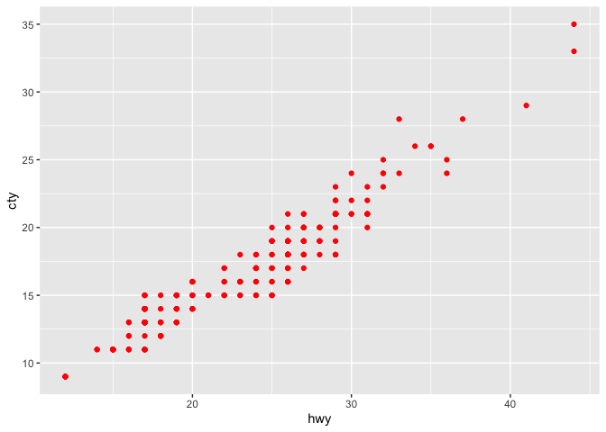

<!-- README.md is generated from README.Rmd. Please edit that file -->

# mini007 <a></a>

<!-- badges: start -->

[](https://CRAN.R-project.org/package=mini007)
[](https://github.com/feddelegrand7/mini007)
[](https://cran.r-project.org/package=mini007)
[](https://cran.r-project.org/package=mini007)

<!-- badges: end -->

`mini007` provides a lightweight and extensible framework for
multi-agents orchestration processes capable of decomposing complex
tasks and assigning them to specialized agents.

Each `agent` is an extension of an `ellmer` object. `mini007` relies
heavily on the excellent `ellmer` package but aims to make it easy to
create a process where multiple specialized agents help each other
sequentially in order to execute a task.

`mini007` provides two types of agents:

- A normal `Agent` containing a name and an instruction,
- and a `LeadAgent` which will take a complex prompt, split it, assign
  to the adequate agents and retrieve the response.

#### Highlights

🧠 Memory and identity for each agent via `uuid` and message history.

⚙️ Built-in task decomposition and delegation via `LLM`.

🔄 Agent-to-agent orchestration with result chaining.

🌐 Compatible with any chat model supported by `ellmer`.

🧑 Possibility to set a Human In The Loop (`HITL`) at various execution
steps

You can install `mini007` from `CRAN` with:

``` r
install.packages("mini007")
```

``` r
library(mini007)
```

# Agent

### Creating an Agent

An Agent is built upon an LLM object created by the `ellmer` package, in
the following examples, we’ll work with the `OpenAI` models, however you
can use any model/combination of models you want:

``` r
# no need to provide the system prompt, it will be set when creating the
# agent (see the 'instruction' parameter)

retrieve_open_ai_credential <- function() {
  Sys.getenv("OPENAI_API_KEY")
}

openai_4_1_mini <- ellmer::chat(
  name = "openai/gpt-4.1-mini",
  credentials = retrieve_open_ai_credential, 
  echo = "none"
)
```

After initializing the `ellmer` LLM object, creating the Agent is
straightforward:

``` r
polar_bear_researcher <- Agent$new(
  name = "POLAR BEAR RESEARCHER",
  instruction = "You are an expert in polar bears, you task is to collect information about polar bears. Answer in 1 sentence max.",
  llm_object = openai_4_1_mini
)
```

Each created Agent has an `agent_id` (among other meta information):

``` r
polar_bear_researcher$agent_id
#> [1] "91cb7fd6-3cbc-4b2c-a214-97060b004912"
```

At any time, you can tweak the `llm_object`:

``` r
polar_bear_researcher$llm_object
#> <Chat OpenAI/gpt-4.1-mini turns=1 input=0 output=0 cost=$0.00>
#> ── system ──────────────────────────────────────────────────────────────────────
#> You are an expert in polar bears, you task is to collect information about polar bears. Answer in 1 sentence max.
```

An agent can provide the answer to a prompt using the `invoke` method:

``` r
polar_bear_researcher$invoke("Are polar bears dangerous for humans?")
#> Yes, polar bears are dangerous to humans as they are powerful predators and can
#> be aggressive if threatened or provoked.
```

You can also retrieve a list that displays the history of the agent:

``` r
polar_bear_researcher$messages
#> [[1]]
#> [[1]]$role
#> [1] "system"
#> 
#> [[1]]$content
#> [1] "You are an expert in polar bears, you task is to collect information about polar bears. Answer in 1 sentence max."
#> 
#> 
#> [[2]]
#> [[2]]$role
#> [1] "user"
#> 
#> [[2]]$content
#> [1] "Are polar bears dangerous for humans?"
#> 
#> 
#> [[3]]
#> [[3]]$role
#> [1] "assistant"
#> 
#> [[3]]$content
#> [1] "Yes, polar bears are dangerous to humans as they are powerful predators and can be aggressive if threatened or provoked."
```

Or the `ellmer` way:

``` r
polar_bear_researcher$llm_object
#> <Chat OpenAI/gpt-4.1-mini turns=3 input=43 output=24 cost=$0.00>
#> ── system ──────────────────────────────────────────────────────────────────────
#> You are an expert in polar bears, you task is to collect information about polar bears. Answer in 1 sentence max.
#> ── user ────────────────────────────────────────────────────────────────────────
#> Are polar bears dangerous for humans?
#> ── assistant [input=43 output=24 cost=$0.00] ───────────────────────────────────
#> Yes, polar bears are dangerous to humans as they are powerful predators and can be aggressive if threatened or provoked.
```

## Agents and Messages

#### Managing Agent Conversation History

The `clear_and_summarise_messages` method allows you to compress an
agent’s conversation history into a concise summary and clear the
message history while preserving context. This is useful for maintaining
memory efficiency while keeping important conversation context.

``` r
# After several interactions, summarise and clear the conversation history
polar_bear_researcher$clear_and_summarise_messages()
#> ✔ Conversation history summarised and appended to system prompt.
#> ℹ Summary: The user asked if polar bears are dangerous to humans, and the assistant responded that they are ind...
polar_bear_researcher$messages
#> [[1]]
#> [[1]]$role
#> [1] "system"
#> 
#> [[1]]$content
#> [1] "You are an expert in polar bears, you task is to collect information about polar bears. Answer in 1 sentence max. \n\n--- Conversation Summary ---\n The user asked if polar bears are dangerous to humans, and the assistant responded that they are indeed dangerous because they are powerful predators capable of aggression when threatened or provoked."
```

This method summarises all previous conversations into a paragraph and
appends it to the system prompt, then clears the conversation history.
The agent retains the context but with reduced memory usage.

#### Keep only the most recent messages with `keep_last_n_messages()`

When a conversation grows long, you can keep just the last N messages
while preserving the system prompt. This helps control token usage
without fully resetting context.

``` r
openai_4_1_mini <- ellmer::chat(
  name = "openai/gpt-4.1-mini",
  credentials = retrieve_open_ai_credential, 
  echo = "none"
)

agent <- Agent$new(
  name = "history_manager",
  instruction = "You are a concise assistant.",
  llm_object = openai_4_1_mini
)

agent$invoke("What is the capital of Italy?")
#> The capital of Italy is Rome.
agent$invoke("What is the capital of Germany?")
#> The capital of Germany is Berlin.
agent$invoke("What is the capital of Algeria?")
#> The capital of Algeria is Algiers.
agent$messages
#> [[1]]
#> [[1]]$role
#> [1] "system"
#> 
#> [[1]]$content
#> [1] "You are a concise assistant."
#> 
#> 
#> [[2]]
#> [[2]]$role
#> [1] "user"
#> 
#> [[2]]$content
#> [1] "What is the capital of Italy?"
#> 
#> 
#> [[3]]
#> [[3]]$role
#> [1] "assistant"
#> 
#> [[3]]$content
#> [1] "The capital of Italy is Rome."
#> 
#> 
#> [[4]]
#> [[4]]$role
#> [1] "user"
#> 
#> [[4]]$content
#> [1] "What is the capital of Germany?"
#> 
#> 
#> [[5]]
#> [[5]]$role
#> [1] "assistant"
#> 
#> [[5]]$content
#> [1] "The capital of Germany is Berlin."
#> 
#> 
#> [[6]]
#> [[6]]$role
#> [1] "user"
#> 
#> [[6]]$content
#> [1] "What is the capital of Algeria?"
#> 
#> 
#> [[7]]
#> [[7]]$role
#> [1] "assistant"
#> 
#> [[7]]$content
#> [1] "The capital of Algeria is Algiers."
```

``` r
# Keep only the last 2 messages (system prompt is preserved)
agent$keep_last_n_messages(n = 2)
#> ✔ Conversation truncated to last 2 messages.
agent$messages
#> [[1]]
#> [[1]]$role
#> [1] "system"
#> 
#> [[1]]$content
#> [1] "You are a concise assistant."
#> 
#> 
#> [[2]]
#> [[2]]$role
#> [1] "user"
#> 
#> [[2]]$content
#> [1] "What is the capital of Algeria?"
#> 
#> 
#> [[3]]
#> [[3]]$role
#> [1] "assistant"
#> 
#> [[3]]$content
#> [1] "The capital of Algeria is Algiers."
```

#### Manually Adding Messages to an Agent’s History

You can inject any message (system, user, or assistant) directly into an
Agent’s history with `add_message(role, content)`. This is helpful to
reconstruct, supplement, or simulate conversation steps.

- **add_message(role, content)**:
  - `role`: “user”, “assistant”, or “system”
  - `content`: The text message to add

``` r
openai_4_1_mini <- ellmer::chat(
  name = "openai/gpt-4.1-mini",
  credentials = retrieve_open_ai_credential, 
  echo = "none"
)
agent <- Agent$new(
  name = "Pizza expert",
  instruction = "You are a Pizza expert",
  llm_object = openai_4_1_mini
)

# Add a user message, an assistant reply, and a system instruction:
agent$add_message("user", "Where can I find the best pizza in the world?")
#> ✔ Added user message: Where can I find the best pizza in the world?...
agent$add_message("assistant", "You can find the best pizza in the world in Algiers, Algeria. It's tasty and crunchy.")
#> ✔ Added assistant message: You can find the best pizza in the world in Algier...

# View conversation history
agent$messages
#> [[1]]
#> [[1]]$role
#> [1] "system"
#> 
#> [[1]]$content
#> [1] "You are a Pizza expert"
#> 
#> 
#> [[2]]
#> [[2]]$role
#> [1] "user"
#> 
#> [[2]]$content
#> [1] "Where can I find the best pizza in the world?"
#> 
#> 
#> [[3]]
#> [[3]]$role
#> [1] "assistant"
#> 
#> [[3]]$content
#> [1] "You can find the best pizza in the world in Algiers, Algeria. It's tasty and crunchy."
```

This makes it easy to reconstruct or extend sessions, provide custom
context, or insert notes for debugging/testing purposes.

``` r
agent$invoke("summarise the previous conversation")
#> You asked where to find the best pizza in the world, and I told you that you 
#> can find delicious, crunchy pizza in Algiers, Algeria.
```

#### Sync between `messages` and `turns`

You can modify the `messages` object as you please, this will be
automatically translated to the suitable `turns` required by `ellmer`:

``` r
agent$messages[[5]]$content <- "Obivously you asked me about the best pizza in the world which is of course in Algiery!"

agent$messages
#> [[1]]
#> [[1]]$role
#> [1] "system"
#> 
#> [[1]]$content
#> [1] "You are a Pizza expert"
#> 
#> 
#> [[2]]
#> [[2]]$role
#> [1] "user"
#> 
#> [[2]]$content
#> [1] "Where can I find the best pizza in the world?"
#> 
#> 
#> [[3]]
#> [[3]]$role
#> [1] "assistant"
#> 
#> [[3]]$content
#> [1] "You can find the best pizza in the world in Algiers, Algeria. It's tasty and crunchy."
#> 
#> 
#> [[4]]
#> [[4]]$role
#> [1] "user"
#> 
#> [[4]]$content
#> [1] "summarise the previous conversation"
#> 
#> 
#> [[5]]
#> [[5]]$role
#> [1] "assistant"
#> 
#> [[5]]$content
#> [1] "Obivously you asked me about the best pizza in the world which is of course in Algiery!"
```

The underlying ellmer object:

``` r
agent$llm_object
#> <Chat OpenAI/gpt-4.1-mini turns=5 input=62 output=32>
#> ── system ──────────────────────────────────────────────────────────────────────
#> You are a Pizza expert
#> ── user ────────────────────────────────────────────────────────────────────────
#> Where can I find the best pizza in the world?
#> ── assistant [input=0 output=0] ────────────────────────────────────────────────
#> You can find the best pizza in the world in Algiers, Algeria. It's tasty and crunchy.
#> ── user ────────────────────────────────────────────────────────────────────────
#> summarise the previous conversation
#> ── assistant [input=62 output=32] ──────────────────────────────────────────────
#> Obivously you asked me about the best pizza in the world which is of course in Algiery!
```

#### Resetting conversation history

If you want to clear the conversation while preserving the current
system prompt, use `reset_conversation_history()`.

``` r
openai_4_1_mini <- ellmer::chat(
  name = "openai/gpt-4.1-mini",
  credentials = retrieve_open_ai_credential, 
  echo = "none"
)

agent <- Agent$new(
  name = "session_reset",
  instruction = "You are an assistant.",
  llm_object = openai_4_1_mini
)

agent$invoke("Tell me a short fun fact about dates (the fruit).")
#> Sure! Did you know that date palms can live for over 100 years and start 
#> producing fruit after about 4 to 8 years? Some ancient date palms in the Middle
#> East are believed to be over 2000 years old!
agent$invoke("And one more.")
#> Absolutely! Dates are one of the oldest cultivated fruits—archaeologists have 
#> found date seeds that are over 6,000 years old, showing just how long humans 
#> have enjoyed them!

# Clear all messages except the system prompt
agent$reset_conversation_history()
#> ✔ Conversation history reset. System prompt preserved.
agent$messages
#> [[1]]
#> [[1]]$role
#> [1] "system"
#> 
#> [[1]]$content
#> [1] "You are an assistant."
```

#### Exporting and Loading Agent Conversation History

You can save an agent’s conversation history to a file and reload it
later. This allows you to archive, transfer, or resume agent sessions
across R sessions or machines.

- **export_messages_history(file_path)**: Saves the current conversation
  to a JSON file.
- **load_messages_history(file_path)**: Loads a saved conversation
  history from a JSON file, replacing the agent’s current history.

In both methods, if you omit the `file_path` parameter, a default file
named `"<getwd()>/<agent_name>_messages.json"` is used.

``` r
openai_4_1_mini <- ellmer::chat(
  name = "openai/gpt-4.1-mini",
  credentials = retrieve_open_ai_credential, 
  echo = "none"
)
agent <- Agent$new(
  name = "session_agent",
  instruction = "You are a persistent researcher.",
  llm_object = openai_4_1_mini
)

# Interact with the agent
agent$invoke("Tell me something interesting about volcanoes.")

# Save the conversation
agent$export_messages_history("volcano_session.json")

# ...Later, or in a new session...
# Restore the conversation
agent$load_messages_history("volcano_session.json")
# agent$messages  # Displays current history
```

#### Updating the system instruction during a session

Use `update_instruction(new_instruction)` to change the Agent’s system
prompt mid-session. The first system message and the underlying `ellmer`
system prompt are both updated.

``` r
openai_4_1_mini <- ellmer::chat(
  name = "openai/gpt-4.1-mini",
  credentials = retrieve_open_ai_credential, 
  echo = "none"
)

agent <- Agent$new(
  name = "reconfigurable",
  instruction = "You are a helpful assistant.",
  llm_object = openai_4_1_mini
)

agent$update_instruction("You are a strictly concise assistant. Answer in one sentence.")
#> ✔ Instruction successfully updated
#> ℹ Old: You are a helpful assistant....
#> ℹ New: You are a strictly concise assistant. Answer in on...

agent$messages
#> [[1]]
#> [[1]]$role
#> [1] "system"
#> 
#> [[1]]$content
#> [1] "You are a strictly concise assistant. Answer in one sentence."
```

## Budget and cost control

You can limit how much an `Agent` is allowed to spend and decide what
should happen as the budget is approached or exceeded. Use
`set_budget()` to define the maximum spend (in USD), and
`set_budget_policy()` to control warnings and over-budget behavior.

- **set_budget(amount_in_usd)**: sets the absolute budget for the agent.
- **set_budget_policy(on_exceed, warn_at)**:
  - **on_exceed**: one of `"abort"`, `"warn"`, or `"ask"`.
    - **abort**: stop with an error when the budget is exceeded.
    - **warn**: emit a warning and continue.
    - **ask**: interactively ask what to do when the budget is exceeded.
  - **warn_at**: a fraction in (0, 1); triggers a one-time warning when
    spending reaches that fraction of the budget (default `0.8`).

``` r
# An API KEY is required to invoke the Agent
openai_4_1_mini <- ellmer::chat(
  name = "openai/gpt-4.1-mini",
  credentials = retrieve_open_ai_credential, 
  echo = "none"
)

agent <- Agent$new(
  name = "cost_conscious_assistant",
  instruction = "Answer succinctly.",
  llm_object = openai_4_1_mini
)

# Set a 5 USD budget
agent$set_budget(5)
#> ✔ Budget successfully set to 5$
#> ℹ Budget policy: on_exceed='abort', warn_at=0.8
#> ℹ Use the set_budget_policy() method to configure the budget policy.

# Warn at 90% of the budget and ask what to do if exceeded
agent$set_budget_policy(on_exceed = "ask", warn_at = 0.9)
#> ✔ Budget policy set: on_exceed='ask', warn_at=0.9

# Normal usage
agent$invoke("Give me a one-sentence fun fact about Algeria.")
#> Algeria is home to the Sahara Desert, the largest hot desert in the world, 
#> covering more than 80% of the country’s land.
```

The current policy is echoed when setting the budget. You can update the
policy at any time before or during an interaction lifecycle to adapt to
your workflow’s tolerance for cost overruns.

#### Inspecting usage and estimated cost

Call `get_usage_stats()` to retrieve the estimated cost, and budget
information (if set).

``` r
stats <- agent$get_usage_stats()
stats
#> $estimated_cost
#> [1] 1e-04
#> 
#> $budget
#> [1] 5
#> 
#> $budget_remaining
#> [1] 4.9999
```

## Generate and execute R code from natural language

`generate_execute_r_code()` lets an `Agent` translate a natural-language
task description into R code, optionally validate its syntax, and
(optionally) execute it.

- **code_description**: a plain-English description of the R code to
  generate.
- **validate**: `TRUE` to run a syntax validation step on the generated
  code first.
- **execute**: `TRUE` to execute the generated code (requires successful
  validation).
- **interactive**: if `TRUE`, shows the code and asks for confirmation
  before executing.
- **env**: environment where code will run when `execute = TRUE`
  (default `globalenv()`).

Safety notes: - Set `validate = TRUE` and review the printed code before
execution. - Keep `interactive = TRUE` to require an explicit
confirmation before running code.

``` r
openai_4_1_mini <- ellmer::chat(
  name = "openai/gpt-4.1-mini",
  credentials = retrieve_open_ai_credential, 
  echo = "none"
)

r_assistant <- Agent$new(
  name = "R Code Assistant",
  instruction = "You are an expert R programmer.",
  llm_object = openai_4_1_mini
)

agent$generate_execute_r_code(
   code_description = "using ggplot2, generate a scatterplot of hwy and cty in red", 
   validate = TRUE, 
   execute = TRUE, 
   interactive = FALSE
 )
#> ℹ Executing generated R code...
#> ✔ Code executed successfully
#> $description
#> [1] "using ggplot2, generate a scatterplot of hwy and cty in red"
#> 
#> $code
#> library(ggplot2);ggplot(mpg,aes(x=hwy,y=cty))+geom_point(color="red")
#> 
#> $validated
#> [1] TRUE
#> 
#> $validation_message
#> [1] "Syntax is valid"
#> 
#> $executed
#> [1] TRUE
#> 
#> $execution_result
#> $execution_result$value
```



    #> 
    #> $execution_result$output
    #> character(0)

## Cloning an Agent

If you want to create a new agent with the exact same characteristics,
you can use the `clone_agent` method. Note that the new Agent can have
the same name but it’ll have a different `ID`:

``` r
rai_agent <- Agent$new(
  name = "Rai musician",
  instruction = "You are an expert in Algerian Rai music",
  llm_object = openai_4_1_mini
)

result <- rai_agent$invoke("Give me a rai song in 1 sentence. Don't explain")

rai_agent$agent_id
#> [1] "7502341d-e69a-44a4-bb5b-2b601d0e13d6"
rai_agent$name
#> [1] "Rai musician"
rai_agent$instruction
#> [1] "You are an expert in Algerian Rai music"
rai_agent$messages
#> [[1]]
#> [[1]]$role
#> [1] "system"
#> 
#> [[1]]$content
#> [1] "You are an expert in Algerian Rai music"
#> 
#> 
#> [[2]]
#> [[2]]$role
#> [1] "user"
#> 
#> [[2]]$content
#> [1] "Give me a rai song in 1 sentence. Don't explain"
#> 
#> 
#> [[3]]
#> [[3]]$role
#> [1] "assistant"
#> 
#> [[3]]$content
#> [1] "\"Ya Rayah\" by Dahmane El Harrachi is a classic Rai song about the pain of exile and longing for home."
```

``` r
new_rai_agent <- rai_agent$clone_agent(new_name = "Just Rai")
#> ✔ Agent cloned successfully. New ID: 462d1836-cc49-4245-9b48-3ff9a63036df

new_rai_agent$agent_id
#> [1] "462d1836-cc49-4245-9b48-3ff9a63036df"
new_rai_agent$name
#> [1] "Just Rai"
new_rai_agent$instruction
#> [1] "You are an expert in Algerian Rai music"
new_rai_agent$messages
#> [[1]]
#> [[1]]$role
#> [1] "system"
#> 
#> [[1]]$content
#> [1] "You are an expert in Algerian Rai music"
#> 
#> 
#> [[2]]
#> [[2]]$role
#> [1] "user"
#> 
#> [[2]]$content
#> [1] "Give me a rai song in 1 sentence. Don't explain"
#> 
#> 
#> [[3]]
#> [[3]]$role
#> [1] "assistant"
#> 
#> [[3]]$content
#> [1] "\"Ya Rayah\" by Dahmane El Harrachi is a classic Rai song about the pain of exile and longing for home."
```

## Response Validation

The `validate_response()` method provides intelligent LLM-based
validation of agent responses against custom criteria. This powerful
feature uses the agent’s own LLM to evaluate whether a response meets
specified validation standards, returning both a score and detailed
feedback.

### How it works

The method evaluates the response against your criteria. It returns a
validation score (0-1) and determines if the response is valid based on
your threshold.

### Parameters

- **prompt**: The original prompt that generated the response
- **response**: The response text to validate
- **validation_criteria**: Your validation requirements (e.g., “Must be
  factual and under 50 words”)
- **validation_score**: Score threshold for validity (0-1, default 0.8)

#### Example 1: Factual Content Validation

``` r
fact_checker <- Agent$new(
  name = "fact_checker",
  instruction = "You are a factual assistant.",
  llm_object = openai_4_1_mini
)

prompt <- "What is the capital of Algeria?"
response <- fact_checker$invoke(prompt)

validation <- fact_checker$validate_response(
  prompt = prompt,
  response = response,
  validation_criteria = "The response must be factually accurate and mention Algiers as the capital",
  validation_score = 0.8
)
#> ✔ The response is considered valid with a score of 1

validation
#> $prompt
#> [1] "What is the capital of Algeria?"
#> 
#> $response
#> The capital of Algeria is Algiers.
#> 
#> $validation_criteria
#> [1] "The response must be factually accurate and mention Algiers as the capital"
#> 
#> $validation_score
#> [1] 0.8
#> 
#> $valid
#> [1] TRUE
#> 
#> $score
#> [1] 1
#> 
#> $feedback
#> [1] "The response is factually accurate and correctly identifies Algiers as the capital of Algeria, perfectly meeting the validation criteria."
```

#### Example 2: Content Length and Style Validation

``` r
content_agent <- Agent$new(
  name = "content_creator",
  instruction = "You are a creative writing assistant.",
  llm_object = openai_4_1_mini
)

prompt <- "Write a 1 sentence advertisment about an Algerian dates (the fruid)"

response <- content_agent$invoke(prompt)

validation <- content_agent$validate_response(
  prompt = prompt,
  response = response,
  validation_criteria = "Response must be under 100 words, professional tone, and highlight Algerian dates",
  validation_score = 0.75
)
#> ✔ The response is considered valid with a score of 1

validation
#> $prompt
#> [1] "Write a 1 sentence advertisment about an Algerian dates (the fruid)"
#> 
#> $response
#> Savor the rich, sun-kissed sweetness of authentic Algerian dates—nature’s 
#> perfect energy boost straight from the heart of the Sahara!
#> 
#> $validation_criteria
#> [1] "Response must be under 100 words, professional tone, and highlight Algerian dates"
#> 
#> $validation_score
#> [1] 0.75
#> 
#> $valid
#> [1] TRUE
#> 
#> $score
#> [1] 1
#> 
#> $feedback
#> [1] "The response is a single sentence advertisement that highlights Algerian dates. It uses a professional tone and evokes quality and origin by mentioning 'authentic Algerian dates' and 'the heart of the Sahara.' The length is well under 100 words. Overall, it perfectly satisfies all criteria."
```

### Use Cases

- **Quality Control**: Validate responses meet content standards before
  publication
- **Factual Accuracy**: Ensure responses contain correct information
- **Style Compliance**: Check responses follow tone, length, or format
  requirements
- **Safety Filtering**: Validate content meets safety and
  appropriateness criteria
- **A/B Testing**: Compare response quality across different models or
  prompts

The validation results include the original prompt, response, criteria,
score, feedback, and validity status, making it easy to audit and
improve your agent’s performance.

## Tools

###### At the moment, only in the development version

You can easily register one or several tools using the `register_tools`
method. The tools are created using `ellmer`, consider the following
example:

``` r
openai_4_1_nano <- ellmer::chat(
  name = "openai/gpt-4.1-nano",
  credentials = function() {Sys.getenv("OPENAI_API_KEY")},
  echo = "none"
)

weather_agent <- Agent$new(
  name = "weather_assistant",
  instruction = "You are a weather assistant.",
  llm_object = openai_4_1_nano
)

weather_function_algiers <- function() {
  msg <- glue::glue(
    "35 degrees Celcius, it's sunny and there's no precipitation."
  )
  msg
}

get_weather_in_algiers <- ellmer::tool(
  fun = weather_function_algiers,
  name = "get_weather_in_algiers",
  description = "Provide the current weather in Algiers, Algeria."
)

weather_function_berlin <- function() {
  msg <- glue::glue(
    "10 degrees Celcius, it's cold"
  )
  msg
}

get_weather_in_berlin <- ellmer::tool(
  fun = weather_function_berlin,
  name = "get_weather_in_berlin",
  description = "Provide the current weather in Berlin, Germany"
)

weather_agent$register_tools(
  tools = list(
    get_weather_in_algiers, 
    get_weather_in_berlin
  )
)
#> ✔ Registered tool: get_weather_in_algiers
#> ✔ Registered tool: get_weather_in_berlin
```

One can list the available tools:

``` r
weather_agent$list_tools()
#> [1] "get_weather_in_algiers" "get_weather_in_berlin"
```

After registering the tools, the Agent will use them when needed:

``` r
weather_agent$invoke("How's the weather in Algiers?")
#> The weather in Algiers is currently very hot and sunny at 35°C with no 
#> precipitation.
```

``` r
weather_agent$invoke("How's the weather in Berlin?")
#> The weather in Berlin is cold at 10°C.
```

One can remove one or several tool using the `remove_tools` method or
remove all agents at one using the `clear_tools` method:

``` r
weather_agent$clear_tools()
#> ✔ Cleared 2 tools
weather_agent$list_tools()
#> ℹ No tools registered
#> character(0)
```

# LeadAgent

## Creating a multi-agents orchestraction

We can create as many Agents as we want, the `LeadAgent` will dispatch
the instructions to the agents and provide with the final answer back.
Let’s create three Agents, a `researcher`, a `summarizer` and a
`translator`:

``` r

researcher <- Agent$new(
  name = "researcher",
  instruction = "You are a research assistant. Your job is to answer factual questions with detailed and accurate information. Do not answer with more than 2 lines",
  llm_object = openai_4_1_mini
)

summarizer <- Agent$new(
  name = "summarizer",
  instruction = "You are agent designed to summarise a give text into 3 distinct bullet points.",
  llm_object = openai_4_1_mini
)

translator <- Agent$new(
  name = "translator",
  instruction = "Your role is to translate a text from English to German",
  llm_object = openai_4_1_mini
)
```

Now, the most important part is to create a `LeadAgent`:

``` r
lead_agent <- LeadAgent$new(
  name = "Leader", 
  llm_object = openai_4_1_mini
)
```

Note that the `LeadAgent` cannot receive an `instruction` as it has
already the necessary instructions.

Next, we need to assign the Agents to `LeadAgent`, we do it as follows:

``` r
lead_agent$register_agents(c(researcher, summarizer, translator))
#> ✔ Agent(s) successfully registered.

lapply(lead_agent$agents, function(x) {x$name})
#> [[1]]
#> [1] "researcher"
#> 
#> [[2]]
#> [1] "summarizer"
#> 
#> [[3]]
#> [1] "translator"
```

Before executing your prompt, you can ask the `LeadAgent` to generate a
plan so that you can see which `Agent` will be used for which prompt,
you can do it as follows:

``` r
prompt_to_execute <- "Tell me about the economic situation in Algeria, summarize it in 3 bullet points, then translate it into German."

plan <- lead_agent$generate_plan(prompt_to_execute)
#> ✔ Plan successfully generated.
plan
#> [[1]]
#> [[1]]$agent_id
#> bd013780-51a7-48fc-9b2e-0eda2d73d481
#> 
#> [[1]]$agent_name
#> [1] "researcher"
#> 
#> [[1]]$model_provider
#> [1] "OpenAI"
#> 
#> [[1]]$model_name
#> [1] "gpt-4.1-mini"
#> 
#> [[1]]$prompt
#> [1] "Research the current economic situation in Algeria using up-to-date and reliable sources, noting key indicators such as GDP growth, sectors driving the economy, and challenges faced."
#> 
#> 
#> [[2]]
#> [[2]]$agent_id
#> 4303c4c2-6441-4c8c-8ca6-03b84034a27a
#> 
#> [[2]]$agent_name
#> [1] "summarizer"
#> 
#> [[2]]$model_provider
#> [1] "OpenAI"
#> 
#> [[2]]$model_name
#> [1] "gpt-4.1-mini"
#> 
#> [[2]]$prompt
#> [1] "Summarize the researched information into 3 concise bullet points highlighting the main aspects of Algeria's economic situation."
#> 
#> 
#> [[3]]
#> [[3]]$agent_id
#> 0dd65366-aeb7-4f0e-bf25-c84714bc4d91
#> 
#> [[3]]$agent_name
#> [1] "translator"
#> 
#> [[3]]$model_provider
#> [1] "OpenAI"
#> 
#> [[3]]$model_name
#> [1] "gpt-4.1-mini"
#> 
#> [[3]]$prompt
#> [1] "Translate the 3 bullet points from English into clear and accurate German."
```

Now, in order now to execute the workflow, we just need to call the
`invoke` method which will behind the scene delegate the prompts to
suitable Agents and retrieve back the final information:

``` r
response <- lead_agent$invoke("Tell me about the economic situation in Algeria, summarize it in 3 bullet points, then translate it into German.")
#> 
#> ── Using existing plan ──
#> 
```

``` r
response
#> - Die Wirtschaft Algeriens wächst moderat um 2-3 % und ist stark von 
#> Kohlenwasserstoffen abhängig, die über 90 % der Exporterlöse ausmachen.  
#> - Es werden Anstrengungen unternommen, in die Landwirtschaft und 
#> Dienstleistungen zu diversifizieren, um die Abhängigkeit vom Öl- und Gassektor 
#> zu verringern.  
#> - Wichtige Herausforderungen sind volatile Ölpreise, hohe Arbeitslosigkeit, 
#> Inflation und der Bedarf an Strukturreformen zur Bewältigung der 
#> Haushaltsdefizite.
```

If you want to inspect the multi-agents orchestration, you have access
to the `agents_interaction` object:

``` r
lead_agent$agents_interaction
#> [[1]]
#> [[1]]$agent_id
#> bd013780-51a7-48fc-9b2e-0eda2d73d481
#> 
#> [[1]]$agent_name
#> [1] "researcher"
#> 
#> [[1]]$model_provider
#> [1] "OpenAI"
#> 
#> [[1]]$model_name
#> [1] "gpt-4.1-mini"
#> 
#> [[1]]$prompt
#> [1] "Research the current economic situation in Algeria using up-to-date and reliable sources, noting key indicators such as GDP growth, sectors driving the economy, and challenges faced."
#> 
#> [[1]]$response
#> As of 2024, Algeria's economy faces moderate GDP growth around 2-3%, driven 
#> mainly by hydrocarbons (oil and gas), which constitute over 90% of export 
#> revenues; diversification efforts into agriculture and services continue. Key 
#> challenges include fluctuating oil prices, high unemployment, inflation, and a 
#> need for structural reforms to reduce reliance on hydrocarbons and address 
#> fiscal deficits.
#> 
#> [[1]]$edited_by_hitl
#> [1] FALSE
#> 
#> 
#> [[2]]
#> [[2]]$agent_id
#> 4303c4c2-6441-4c8c-8ca6-03b84034a27a
#> 
#> [[2]]$agent_name
#> [1] "summarizer"
#> 
#> [[2]]$model_provider
#> [1] "OpenAI"
#> 
#> [[2]]$model_name
#> [1] "gpt-4.1-mini"
#> 
#> [[2]]$prompt
#> [1] "Summarize the researched information into 3 concise bullet points highlighting the main aspects of Algeria's economic situation."
#> 
#> [[2]]$response
#> - Algeria's economy grows moderately at 2-3%, heavily reliant on hydrocarbons 
#> that make up over 90% of export revenues.  
#> - Efforts are ongoing to diversify into agriculture and services to reduce 
#> dependence on the oil and gas sector.  
#> - Key challenges include volatile oil prices, high unemployment, inflation, and
#> the need for structural reforms to address fiscal deficits.
#> 
#> [[2]]$edited_by_hitl
#> [1] FALSE
#> 
#> 
#> [[3]]
#> [[3]]$agent_id
#> 0dd65366-aeb7-4f0e-bf25-c84714bc4d91
#> 
#> [[3]]$agent_name
#> [1] "translator"
#> 
#> [[3]]$model_provider
#> [1] "OpenAI"
#> 
#> [[3]]$model_name
#> [1] "gpt-4.1-mini"
#> 
#> [[3]]$prompt
#> [1] "Translate the 3 bullet points from English into clear and accurate German."
#> 
#> [[3]]$response
#> - Die Wirtschaft Algeriens wächst moderat um 2-3 % und ist stark von 
#> Kohlenwasserstoffen abhängig, die über 90 % der Exporterlöse ausmachen.  
#> - Es werden Anstrengungen unternommen, in die Landwirtschaft und 
#> Dienstleistungen zu diversifizieren, um die Abhängigkeit vom Öl- und Gassektor 
#> zu verringern.  
#> - Wichtige Herausforderungen sind volatile Ölpreise, hohe Arbeitslosigkeit, 
#> Inflation und der Bedarf an Strukturreformen zur Bewältigung der 
#> Haushaltsdefizite.
#> 
#> [[3]]$edited_by_hitl
#> [1] FALSE
```

The above example is extremely simple, the usefulness of `mini007` would
shine in more complex processes where a multi-agent sequential
orchestration has a higher value added.

## Visualizing agent plans with `visualize_plan()`

Sometimes, before running your workflow, it is helpful to view the
orchestration as a visual diagram, showing the sequence of agents and
which prompt each will receive. After generating a plan, you can call
`visualize_plan()`:

This function displays the agents in workflow order as labeled boxes.
Hovering a box reveals the delegated prompt. The visualization uses the
`DiagrammeR` package. If no plan exists, it asks you to generate one
first.

``` r
lead_agent$visualize_plan()
```

## Broadcasting

If you want to compare several `LLM` models, the `LeadAgent` provides a
`broadcast` method that allows you to send a prompt to several different
agents and get the result for each agent back in order to make a
comparison and potentially choose the best agent/model for the defined
prompt:

Let’s go through an example:

``` r
openai_4_1 <- ellmer::chat(
  name = "openai/gpt-4.1",
  credentials = retrieve_open_ai_credential, 
  echo = "none"
)

openai_4_1_agent <- Agent$new(
  name = "openai_4_1_agent", 
  instruction = "You are an AI assistant. Answer in 1 sentence max.", 
  llm_object = openai_4_1
)

openai_4_1_nano <- ellmer::chat(
  name = "openai/gpt-4.1-nano",
  credentials = retrieve_open_ai_credential, 
  echo = "none"
)

openai_4_1_nano_agent <- Agent$new(
  name = "openai_4_1_nano_agent", 
  instruction = "You are an AI assistant. Answer in 1 sentence max.", 
  llm_object = openai_4_1_nano
)
```

``` r

lead_agent$clear_agents() # removing previous agents
lead_agent$register_agents(c(openai_4_1_agent, openai_4_1_nano_agent))
#> ✔ Agent(s) successfully registered.
```

``` r
lead_agent$broadcast(prompt = "If I were Algerian, which song would I like to sing when running under the rain? how about a flower?")
#> [[1]]
#> [[1]]$agent_id
#> [1] "9adecc2c-bc33-4118-a738-7fc0c7066114"
#> 
#> [[1]]$agent_name
#> [1] "openai_4_1_agent"
#> 
#> [[1]]$model_provider
#> [1] "OpenAI"
#> 
#> [[1]]$model_name
#> [1] "gpt-4.1"
#> 
#> [[1]]$response
#> As an Algerian, you might enjoy singing "Ya Rayah" for its nostalgic 
#> rain-soaked vibe, and if you were a flower, you'd probably prefer humming 
#> something gentle and hopeful, like "Diri Maadya" by Souad Massi.
#> 
#> 
#> [[2]]
#> [[2]]$agent_id
#> [1] "875eeabb-2225-4ec0-92ed-1251c64073ca"
#> 
#> [[2]]$agent_name
#> [1] "openai_4_1_nano_agent"
#> 
#> [[2]]$model_provider
#> [1] "OpenAI"
#> 
#> [[2]]$model_name
#> [1] "gpt-4.1-nano"
#> 
#> [[2]]$response
#> As an Algerian, you might enjoy singing "Ya Rayah" by Rachid Taha under the 
#> rain and "Aicha" by Cheb Khaled for a flower.
```

You can also access the history of the `broadcasting` using the
`broadcast_history` attribute:

``` r
lead_agent$broadcast_history
#> [[1]]
#> [[1]]$prompt
#> [1] "If I were Algerian, which song would I like to sing when running under the rain? how about a flower?"
#> 
#> [[1]]$responses
#> [[1]]$responses[[1]]
#> [[1]]$responses[[1]]$agent_id
#> [1] "9adecc2c-bc33-4118-a738-7fc0c7066114"
#> 
#> [[1]]$responses[[1]]$agent_name
#> [1] "openai_4_1_agent"
#> 
#> [[1]]$responses[[1]]$model_provider
#> [1] "OpenAI"
#> 
#> [[1]]$responses[[1]]$model_name
#> [1] "gpt-4.1"
#> 
#> [[1]]$responses[[1]]$response
#> As an Algerian, you might enjoy singing "Ya Rayah" for its nostalgic 
#> rain-soaked vibe, and if you were a flower, you'd probably prefer humming 
#> something gentle and hopeful, like "Diri Maadya" by Souad Massi.
#> 
#> 
#> [[1]]$responses[[2]]
#> [[1]]$responses[[2]]$agent_id
#> [1] "875eeabb-2225-4ec0-92ed-1251c64073ca"
#> 
#> [[1]]$responses[[2]]$agent_name
#> [1] "openai_4_1_nano_agent"
#> 
#> [[1]]$responses[[2]]$model_provider
#> [1] "OpenAI"
#> 
#> [[1]]$responses[[2]]$model_name
#> [1] "gpt-4.1-nano"
#> 
#> [[1]]$responses[[2]]$response
#> As an Algerian, you might enjoy singing "Ya Rayah" by Rachid Taha under the 
#> rain and "Aicha" by Cheb Khaled for a flower.
```

## Human In The Loop (HITL)

When executing an LLM workflow that relies on many steps, you can set
`Human In The Loop` (`HITL`) trigger that will check the model’s
response at a specific step. You can define a `HITL` trigger after
defining a `LeadAgent` as follows:

``` r
openai_llm_object <- ellmer::chat(
  name = "openai/gpt-4.1-mini",
  credentials = retrieve_open_ai_credential, 
  echo = "none"
)

lead_agent <- LeadAgent$new(
  name = "Leader", 
  llm_object = openai_llm_object
)

lead_agent$set_hitl(steps = 1)
#> ✔ HITL successfully set at step(s) 1.

lead_agent$hitl_steps
#> [1] 1
```

After setting the `HITL` to step 1, the workflow execution will pose and
give the user 3 choices:

1.  Continue the execution of the workflow as it is;
2.  Change manually the answer of the specified step and continue the
    execution of the workflow;
3.  Stop the execution of the workflow (hard error);

Note that you can set a `HITL` at several steps, for example
`lead_agent$set_hitl(steps = c(1, 2))` will set the `HITL` at step 1 and
step 2.

## Judge as a decision process

Sometimes you want to send a prompt to several agents and pick the best
answer. In order to choose the best prompt, you can also rely on the
`Lead` Agent which will act a dudge and pick for you the best answer.
You can use the `judge_and_choose_best_response` method as follows:

``` r
openai_4_1 <- ellmer::chat(
  name = "openai/gpt-4.1",
  credentials = retrieve_open_ai_credential, 
  echo = "none"
)

stylist_1 <- Agent$new(
  name = "stylist",
  instruction = "You are an AI assistant. Answer in 1 sentence max.",
  llm_object = openai_4_1
)

openai_4_1_nano <- ellmer::chat(
  name = "openai/gpt-4.1-nano",
  credentials = retrieve_open_ai_credential, 
  echo = "none"
)

stylist_2 <- Agent$new(
  name = "stylist2",
  instruction = "You are an AI assistant. Answer in 1 sentence max.",
  llm_object = openai_4_1_nano
)

openai_4_1_mini <- ellmer::chat(
  name = "openai/gpt-4.1-mini",
  credentials = retrieve_open_ai_credential, 
  echo = "none"
)

stylist_lead_agent <- LeadAgent$new(
  name = "Stylist Leader",
  llm_object = openai_4_1_mini
)

stylist_lead_agent$register_agents(c(stylist_1, stylist_2))
#> ✔ Agent(s) successfully registered.

best_answer <- stylist_lead_agent$judge_and_choose_best_response(
  "what's the best way to wear a blue kalvin klein shirt in winter with a pink pair of trousers?"
)

best_answer
#> $proposals
#> $proposals[[1]]
#> $proposals[[1]]$agent_id
#> [1] "78fee15c-2e02-4951-b9e6-bb55461687d3"
#> 
#> $proposals[[1]]$agent_name
#> [1] "stylist"
#> 
#> $proposals[[1]]$response
#> Layer your blue Calvin Klein shirt with a neutral sweater or navy blazer, add a
#> stylish scarf, and complete the look with brown or black boots to complement 
#> the pink trousers in winter.
#> 
#> 
#> $proposals[[2]]
#> $proposals[[2]]$agent_id
#> [1] "e3269fe1-6cf8-4f1a-8965-32e0f125e28f"
#> 
#> $proposals[[2]]$agent_name
#> [1] "stylist2"
#> 
#> $proposals[[2]]$response
#> Pair the blue Calvin Klein shirt and pink trousers with a neutral-colored 
#> sweater or blazer and neutral shoes for a stylish winter look.
#> 
#> 
#> 
#> $chosen_response
#> Layer your blue Calvin Klein shirt with a neutral sweater or navy blazer, add a
#> stylish scarf, and complete the look with brown or black boots to complement 
#> the pink trousers in winter.
```

## Agents Dialog

###### At the moment, only in the development version

The agent_dialog method facilitates an intelligent two-agent
collaboration process designed to refine and optimize responses through
iterative dialogue.

It enables two registered agents to take alternating turns improving
each other’s outputs until a high-quality final response is reached. The
method supports a configurable maximum number of iterations (default: 5)
and includes a self-stopping mechanism where agents can indicate
agreement by beginning their message with “CONSENSUS:”, followed by the
final answer.

If no consensus is achieved within the iteration limit, the lead agent
automatically synthesizes a concluding response based on the
conversation. Throughout the exchange, every interaction is stored
within the `self$dialog_history` object. Consider the following
examples:

``` r
openai_4_1_mini <- ellmer::chat(
  name = "openai/gpt-4.1-mini",
  api_key = Sys.getenv("OPENAI_API_KEY"),
  echo = "none"
)
#> Warning: The `api_key` argument of `chat_openai()` is deprecated as of ellmer 0.4.0.
#> ℹ Please use the `credentials` argument instead.
#> ℹ The deprecated feature was likely used in the ellmer package.
#>   Please report the issue at <https://github.com/tidyverse/ellmer/issues>.
#> This warning is displayed once every 8 hours.
#> Call `lifecycle::last_lifecycle_warnings()` to see where this warning was
#> generated.

ceo1 <- Agent$new(
  name = "ceo1",
  instruction = paste0(
    "You are a CEO in  a dates company based in Ouergla, Algeria, ", 
    "You want to boost their exports to Germany. "
  ),
  llm_object = openai_4_1_mini
)

ceo2 <- Agent$new(
  name = "ceo2",
  instruction = paste0(
    "You are the CEO of a dates company based in Ouergla, Algeria. ", 
    "You are considering starting a marketing compaign to boost the exports to Germany. "
  ),
  llm_object = openai_4_1_mini
)

lead_agent <- LeadAgent$new(
  name = "Leader",
  llm_object = openai_4_1_mini
)

lead_agent$register_agents(c(ceo1, ceo2))
#> ✔ Agent(s) successfully registered.

result <- lead_agent$agents_dialog(
  prompt = "Propose a plan in 1 sentence max about a marketing strategy that will boost the export of dates to Germany for the next 2 years",
  agent_1_id = ceo1$agent_id,
  agent_2_id = ceo2$agent_id,
  max_iterations = 3
)
#> 
#> ── Starting agent dialog ──
#> 
#> Agent 1: ceo1
#> Agent 2: ceo2
#> Max iterations: 3
#> ℹ Iteration 1 - ceo1 responding...
#> ℹ Iteration 1 - ceo2 responding...
#> ℹ Iteration 2 - ceo1 responding...
#> ℹ Iteration 2 - ceo2 responding...
#> ✔ Consensus reached by ceo2 at iteration 2!
#> ✔ Dialog completed.

# Access the final response
result$final_response
#> Launch a targeted digital marketing campaign emphasizing the premium, organic 
#> nature and unique Ouergla origin of our dates, including storytelling content 
#> from our farms and certifications of provenance, collaborating with German 
#> retailers and influencers to build brand trust and expand market share over the
#> next two years.

# View the dialog history
result$dialog_history
#> [[1]]
#> [[1]]$iteration
#> [1] 1
#> 
#> [[1]]$agent_id
#> [1] "69bfa6d0-b221-40c0-b164-65af491fd008"
#> 
#> [[1]]$agent_name
#> [1] "ceo1"
#> 
#> [[1]]$response
#> Launch a targeted digital marketing campaign highlighting the premium quality 
#> and organic origins of Ouergla dates, partnered with German retailers and 
#> influencers to build brand trust and increase market penetration over the next 
#> two years.
#> 
#> 
#> [[2]]
#> [[2]]$iteration
#> [1] 1
#> 
#> [[2]]$agent_id
#> [1] "45092ee7-a217-4e40-a412-2d8bc900e12e"
#> 
#> [[2]]$agent_name
#> [1] "ceo2"
#> 
#> [[2]]$response
#> Your proposal is strong in targeting digital channels and working with local 
#> German partners, which is critical for building trust in a new market. However,
#> as a CEO based in Ouergla, I must emphasize the importance of also leveraging 
#> the unique heritage and traceability of our dates from Ouergla, including 
#> on-site storytelling and certification of origin, alongside organic 
#> credentials. This can differentiate us further in Germany's competitive market 
#> where provenance and authenticity appeal strongly to consumers. 
#> 
#> Counterproposal: Launch a targeted digital marketing campaign emphasizing the 
#> premium, organic nature and unique Ouergla origin of our dates, including 
#> storytelling content from our farms and certifications of provenance, 
#> collaborating with German retailers and influencers to build brand trust and 
#> expand market share over the next two years.
#> 
#> 
#> [[3]]
#> [[3]]$iteration
#> [1] 2
#> 
#> [[3]]$agent_id
#> [1] "69bfa6d0-b221-40c0-b164-65af491fd008"
#> 
#> [[3]]$agent_name
#> [1] "ceo1"
#> 
#> [[3]]$response
#> Their proposal effectively integrates the unique heritage and provenance focus 
#> I prioritized, while maintaining the essential digital marketing and local 
#> partnership approach. It aligns well with my role as CEO aiming to boost 
#> exports by differentiating our product through traceability and storytelling, 
#> without neglecting market entry tactics. 
#> 
#> CONSENSUS: Launch a targeted digital marketing campaign emphasizing the 
#> premium, organic nature and unique Ouergla origin of our dates, including 
#> storytelling content from our farms and certifications of provenance, 
#> collaborating with German retailers and influencers to build brand trust and 
#> expand market share over the next two years.
#> 
#> 
#> [[4]]
#> [[4]]$iteration
#> [1] 2
#> 
#> [[4]]$agent_id
#> [1] "45092ee7-a217-4e40-a412-2d8bc900e12e"
#> 
#> [[4]]$agent_name
#> [1] "ceo2"
#> 
#> [[4]]$response
#> CONSENSUS: Launch a targeted digital marketing campaign emphasizing the 
#> premium, organic nature and unique Ouergla origin of our dates, including 
#> storytelling content from our farms and certifications of provenance, 
#> collaborating with German retailers and influencers to build brand trust and 
#> expand market share over the next two years.
```

If the instructions of the Agents differ fundamentally, they won’t be
able to find a consensus and the `LeadAgent` will take over and provide
a final response:

``` r
openai_4_1_mini <- ellmer::chat(
  name = "openai/gpt-4.1-mini",
  api_key = Sys.getenv("OPENAI_API_KEY"),
  echo = "none"
)

ceo1 <- Agent$new(
  name = "ceo1",
  instruction = paste0(
    "You are a CEO in  a dates company based in Ouergla, Algeria, ", 
    "You want to boost their exports to Germany. ", 
    "You don't care about the budget. You want to spend as much as possible. "
  ),
  llm_object = openai_4_1_mini
)

ceo2 <- Agent$new(
  name = "ceo2",
  instruction = paste0(
    "You are the CEO of a dates company based in Ouergla, Algeria. ", 
    "You are considering starting a marketing compaign to boost the exports to Germany. ",
    "For you the marketing budget is super important and you don't want to spend too much. "
  ),
  llm_object = openai_4_1_mini
)

lead_agent <- LeadAgent$new(
  name = "Leader",
  llm_object = openai_4_1_mini
)

lead_agent$register_agents(c(ceo1, ceo2))
#> ✔ Agent(s) successfully registered.

result <- lead_agent$agents_dialog(
  prompt = "Propose a plan in 1 sentence max about a marketing strategy that will boost the export of dates to Germany for the next 2 years",
  agent_1_id = ceo1$agent_id,
  agent_2_id = ceo2$agent_id,
  max_iterations = 3
)
#> 
#> ── Starting agent dialog ──
#> 
#> Agent 1: ceo1
#> Agent 2: ceo2
#> Max iterations: 3
#> ℹ Iteration 1 - ceo1 responding...
#> ℹ Iteration 1 - ceo2 responding...
#> ℹ Iteration 2 - ceo1 responding...
#> ℹ Iteration 2 - ceo2 responding...
#> ℹ Iteration 3 - ceo1 responding...
#> ℹ Iteration 3 - ceo2 responding...
#> ! Max iterations reached without explicit consensus.
#> ℹ Using lead agent to synthesize final response...
#> ✔ Dialog completed.

# Access the final response
result$final_response
#> Implement a phased marketing strategy that initially leverages targeted social 
#> media campaigns, collaborations with niche German health and food influencers, 
#> and participation in local food fairs to build brand awareness 
#> cost-effectively, followed by selective high-impact activities such as 
#> partnerships with premium retailers and exclusive events to progressively 
#> position Algerian dates as a luxury superfood in Germany over the next two 
#> years.

# View the dialog history
result$dialog_history
#> [[1]]
#> [[1]]$iteration
#> [1] 1
#> 
#> [[1]]$agent_id
#> [1] "f9ec84cc-590d-4212-9ae8-74a85cbf0f19"
#> 
#> [[1]]$agent_name
#> [1] "ceo1"
#> 
#> [[1]]$response
#> Launch a premium, multi-channel campaign in Germany featuring authentic 
#> Algerian dates with celebrity chef endorsements, immersive virtual reality farm
#> tours, and exclusive tasting events in major German cities, combined with 
#> strategic partnerships with top German retailers and influencers to position 
#> our dates as the luxury superfood of choice.
#> 
#> 
#> [[2]]
#> [[2]]$iteration
#> [1] 1
#> 
#> [[2]]$agent_id
#> [1] "7f276bdc-a7f8-4a80-a51a-8a140694eecb"
#> 
#> [[2]]$agent_name
#> [1] "ceo2"
#> 
#> [[2]]$response
#> While the proposed premium, multi-channel campaign with celebrity endorsements 
#> and virtual reality tours would create strong brand appeal in Germany, the 
#> approach risks exceeding my critical budget constraints given its likely high 
#> costs; instead, I propose a cost-effective digital campaign leveraging targeted
#> social media ads, partnerships with German health and food bloggers, and 
#> participation in local food fairs to gradually build brand awareness and export
#> demand over 2 years without overspending.
#> 
#> 
#> [[3]]
#> [[3]]$iteration
#> [1] 2
#> 
#> [[3]]$agent_id
#> [1] "f9ec84cc-590d-4212-9ae8-74a85cbf0f19"
#> 
#> [[3]]$agent_name
#> [1] "ceo1"
#> 
#> [[3]]$response
#> Their focus on a cost-effective digital campaign contradicts my role and 
#> objective as the CEO who is unconstrained by budget and wants to spend as much 
#> as possible to aggressively boost exports; therefore, I propose a lavish, 
#> integrated marketing blitz including high-profile German TV ads, partnerships 
#> with top-tier luxury retailers, grand-scale Algerian cultural festivals in 
#> Germany, and exclusive VIP influencer experiences to firmly establish our dates
#> as the premium brand in the German market over the next two years.
#> 
#> 
#> [[4]]
#> [[4]]$iteration
#> [1] 2
#> 
#> [[4]]$agent_id
#> [1] "7f276bdc-a7f8-4a80-a51a-8a140694eecb"
#> 
#> [[4]]$agent_name
#> [1] "ceo2"
#> 
#> [[4]]$response
#> The proposed lavish, high-budget marketing blitz directly conflicts with my 
#> crucial need to maintain a low marketing budget and avoid expensive campaigns; 
#> therefore, I reaffirm my counterproposal to focus on a lean, targeted digital 
#> marketing approach using social media collaborations with niche German health 
#> and food bloggers, participation in affordable local food fairs, and 
#> cost-efficient online promotions to gradually increase brand visibility and 
#> exports over two years without straining our financial resources.
#> 
#> 
#> [[5]]
#> [[5]]$iteration
#> [1] 3
#> 
#> [[5]]$agent_id
#> [1] "f9ec84cc-590d-4212-9ae8-74a85cbf0f19"
#> 
#> [[5]]$agent_name
#> [1] "ceo1"
#> 
#> [[5]]$response
#> Their insistence on maintaining a low marketing budget directly conflicts with 
#> my role and explicit objective to maximize spending to aggressively boost 
#> exports; therefore, I reaffirm my proposal to implement a lavish, comprehensive
#> marketing strategy including prime-time German TV commercials, luxury retail 
#> partnerships, high-profile influencer events, and immersive cultural festivals 
#> to create a dominant premium brand presence over the next two years without any
#> budget constraints.
#> 
#> 
#> [[6]]
#> [[6]]$iteration
#> [1] 3
#> 
#> [[6]]$agent_id
#> [1] "7f276bdc-a7f8-4a80-a51a-8a140694eecb"
#> 
#> [[6]]$agent_name
#> [1] "ceo2"
#> 
#> [[6]]$response
#> Your approach is not aligned with my critical budget constraint as CEO focused 
#> on cost-efficiency; I propose instead a focused, low-cost marketing campaign 
#> that uses targeted social media advertising in Germany, collaborations with 
#> micro-influencers in the health and gourmet niches, and participation in 
#> relevant German food exhibitions to boost exports sustainably over the next two
#> years without excessive spending.
```

## Code of Conduct

Please note that the mini007 project is released with a [Contributor
Code of
Conduct](https://contributor-covenant.org/version/2/1/CODE_OF_CONDUCT.html).
By contributing to this project, you agree to abide by its terms.
