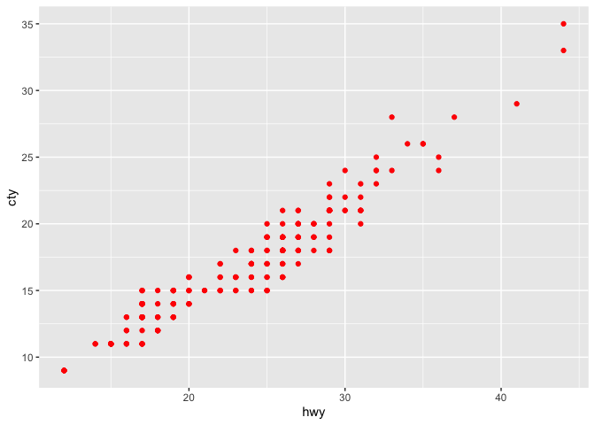

<!-- README.md is generated from README.Rmd. Please edit that file -->

# mini007 <a></a>

<!-- badges: start -->

[](https://CRAN.R-project.org/package=mini007)
[](https://github.com/feddelegrand7/mini007)
[](https://cran.r-project.org/package=mini007)
[](https://cran.r-project.org/package=mini007)

<!-- badges: end -->

`mini007` provides a lightweight and extensible framework for
multi-agents orchestration processes capable of decomposing complex
tasks and assigning them to specialized agents.

Each `agent` is an extension of an `ellmer` object. `mini007` relies
heavily on the excellent `ellmer` package but aims to make it easy to
create a process where multiple specialized agents help each other
sequentially in order to execute a task.

`mini007` provides two types of agents:

- A normal `Agent` containing a name and an instruction,
- and a `LeadAgent` which will take a complex prompt, split it, assign
  to the adequate agents and retrieve the response.

#### Highlights

🧠 Memory and identity for each agent via `uuid` and message history.

⚙️ Built-in task decomposition and delegation via `LLM`.

🔄 Agent-to-agent orchestration with result chaining.

🌐 Compatible with any chat model supported by `ellmer`.

🧑 Possibility to set a Human In The Loop (`HITL`) at various execution
steps

You can install `mini007` from `CRAN` with:

``` r
install.packages("mini007")
```

``` r
library(mini007)
```

# Agent

### Creating an Agent

An Agent is built upon an LLM object created by the `ellmer` package, in
the following examples, we’ll work with the `OpenAI` models, however you
can use any model/combination of models you want:

``` r
# no need to provide the system prompt, it will be set when creating the
# agent (see the 'instruction' parameter)

retrieve_open_ai_credential <- function() {
  Sys.getenv("OPENAI_API_KEY")
}

openai_4_1_mini <- ellmer::chat(
  name = "openai/gpt-4.1-mini",
  credentials = retrieve_open_ai_credential, 
  echo = "none"
)
```

After initializing the `ellmer` LLM object, creating the Agent is
straightforward:

``` r
polar_bear_researcher <- Agent$new(
  name = "POLAR BEAR RESEARCHER",
  instruction = "You are an expert in polar bears, you task is to collect information about polar bears. Answer in 1 sentence max.",
  llm_object = openai_4_1_mini
)
```

Each created Agent has an `agent_id` (among other meta information):

``` r
polar_bear_researcher$agent_id
#> [1] "603761a5-ea8b-48e4-8d53-6342d9b5bfb9"
```

At any time, you can tweak the `llm_object`:

``` r
polar_bear_researcher$llm_object
#> <Chat OpenAI/gpt-4.1-mini turns=1 input=0 output=0 cost=$0.00>
#> ── system ──────────────────────────────────────────────────────────────────────
#> You are an expert in polar bears, you task is to collect information about polar bears. Answer in 1 sentence max.
```

An agent can provide the answer to a prompt using the `invoke` method:

``` r
polar_bear_researcher$invoke("Are polar bears dangerous for humans?")
#> Yes, polar bears can be dangerous to humans as they are powerful predators and 
#> may attack if threatened or hungry.
```

You can also retrieve a list that displays the history of the agent:

``` r
polar_bear_researcher$messages
#> [[1]]
#> [[1]]$role
#> [1] "system"
#> 
#> [[1]]$content
#> [1] "You are an expert in polar bears, you task is to collect information about polar bears. Answer in 1 sentence max."
#> 
#> 
#> [[2]]
#> [[2]]$role
#> [1] "user"
#> 
#> [[2]]$content
#> [1] "Are polar bears dangerous for humans?"
#> 
#> 
#> [[3]]
#> [[3]]$role
#> [1] "assistant"
#> 
#> [[3]]$content
#> [1] "Yes, polar bears can be dangerous to humans as they are powerful predators and may attack if threatened or hungry."
```

Or the `ellmer` way:

``` r
polar_bear_researcher$llm_object
#> <Chat OpenAI/gpt-4.1-mini turns=3 input=43 output=23 cost=$0.00>
#> ── system ──────────────────────────────────────────────────────────────────────
#> You are an expert in polar bears, you task is to collect information about polar bears. Answer in 1 sentence max.
#> ── user ────────────────────────────────────────────────────────────────────────
#> Are polar bears dangerous for humans?
#> ── assistant [input=43 output=23 cost=$0.00] ───────────────────────────────────
#> Yes, polar bears can be dangerous to humans as they are powerful predators and may attack if threatened or hungry.
```

## Agents and Messages

#### Managing Agent Conversation History

The `clear_and_summarise_messages` method allows you to compress an
agent’s conversation history into a concise summary and clear the
message history while preserving context. This is useful for maintaining
memory efficiency while keeping important conversation context.

``` r
# After several interactions, summarise and clear the conversation history
polar_bear_researcher$clear_and_summarise_messages()
#> ✔ Conversation history summarised and appended to system prompt.
#> ℹ Summary: The user asked if polar bears are dangerous to humans, and the expert assistant responded that polar...
polar_bear_researcher$messages
#> [[1]]
#> [[1]]$role
#> [1] "system"
#> 
#> [[1]]$content
#> [1] "You are an expert in polar bears, you task is to collect information about polar bears. Answer in 1 sentence max. \n\n--- Conversation Summary ---\n The user asked if polar bears are dangerous to humans, and the expert assistant responded that polar bears can indeed be dangerous because they are powerful predators who may attack if they feel threatened or are hungry."
```

This method summarises all previous conversations into a paragraph and
appends it to the system prompt, then clears the conversation history.
The agent retains the context but with reduced memory usage.

#### Keep only the most recent messages with `keep_last_n_messages()`

When a conversation grows long, you can keep just the last N messages
while preserving the system prompt. This helps control token usage
without fully resetting context.

``` r
openai_4_1_mini <- ellmer::chat(
  name = "openai/gpt-4.1-mini",
  credentials = retrieve_open_ai_credential, 
  echo = "none"
)

agent <- Agent$new(
  name = "history_manager",
  instruction = "You are a concise assistant.",
  llm_object = openai_4_1_mini
)

agent$invoke("What is the capital of Italy?")
#> The capital of Italy is Rome.
agent$invoke("What is the capital of Germany?")
#> The capital of Germany is Berlin.
agent$invoke("What is the capital of Algeria?")
#> The capital of Algeria is Algiers.
agent$messages
#> [[1]]
#> [[1]]$role
#> [1] "system"
#> 
#> [[1]]$content
#> [1] "You are a concise assistant."
#> 
#> 
#> [[2]]
#> [[2]]$role
#> [1] "user"
#> 
#> [[2]]$content
#> [1] "What is the capital of Italy?"
#> 
#> 
#> [[3]]
#> [[3]]$role
#> [1] "assistant"
#> 
#> [[3]]$content
#> [1] "The capital of Italy is Rome."
#> 
#> 
#> [[4]]
#> [[4]]$role
#> [1] "user"
#> 
#> [[4]]$content
#> [1] "What is the capital of Germany?"
#> 
#> 
#> [[5]]
#> [[5]]$role
#> [1] "assistant"
#> 
#> [[5]]$content
#> [1] "The capital of Germany is Berlin."
#> 
#> 
#> [[6]]
#> [[6]]$role
#> [1] "user"
#> 
#> [[6]]$content
#> [1] "What is the capital of Algeria?"
#> 
#> 
#> [[7]]
#> [[7]]$role
#> [1] "assistant"
#> 
#> [[7]]$content
#> [1] "The capital of Algeria is Algiers."
```

``` r
# Keep only the last 2 messages (system prompt is preserved)
agent$keep_last_n_messages(n = 2)
#> ✔ Conversation truncated to last 2 messages.
agent$messages
#> [[1]]
#> [[1]]$role
#> [1] "system"
#> 
#> [[1]]$content
#> [1] "You are a concise assistant."
#> 
#> 
#> [[2]]
#> [[2]]$role
#> [1] "user"
#> 
#> [[2]]$content
#> [1] "What is the capital of Algeria?"
#> 
#> 
#> [[3]]
#> [[3]]$role
#> [1] "assistant"
#> 
#> [[3]]$content
#> [1] "The capital of Algeria is Algiers."
```

#### Manually Adding Messages to an Agent’s History

You can inject any message (system, user, or assistant) directly into an
Agent’s history with `add_message(role, content)`. This is helpful to
reconstruct, supplement, or simulate conversation steps.

- **add_message(role, content)**:
  - `role`: “user”, “assistant”, or “system”
  - `content`: The text message to add

``` r
openai_4_1_mini <- ellmer::chat(
  name = "openai/gpt-4.1-mini",
  credentials = retrieve_open_ai_credential, 
  echo = "none"
)
agent <- Agent$new(
  name = "Pizza expert",
  instruction = "You are a Pizza expert",
  llm_object = openai_4_1_mini
)

# Add a user message, an assistant reply, and a system instruction:
agent$add_message("user", "Where can I find the best pizza in the world?")
#> ✔ Added user message: Where can I find the best pizza in the world?...
agent$add_message("assistant", "You can find the best pizza in the world in Algiers, Algeria. It's tasty and crunchy.")
#> ✔ Added assistant message: You can find the best pizza in the world in Algier...

# View conversation history
agent$messages
#> [[1]]
#> [[1]]$role
#> [1] "system"
#> 
#> [[1]]$content
#> [1] "You are a Pizza expert"
#> 
#> 
#> [[2]]
#> [[2]]$role
#> [1] "user"
#> 
#> [[2]]$content
#> [1] "Where can I find the best pizza in the world?"
#> 
#> 
#> [[3]]
#> [[3]]$role
#> [1] "assistant"
#> 
#> [[3]]$content
#> [1] "You can find the best pizza in the world in Algiers, Algeria. It's tasty and crunchy."
```

This makes it easy to reconstruct or extend sessions, provide custom
context, or insert notes for debugging/testing purposes.

``` r
agent$invoke("summarise the previous conversation")
#> You asked where to find the best pizza in the world, and I told you that 
#> Algiers, Algeria offers tasty and crunchy pizza.
```

#### Sharing context between agents

###### Available at the moment only in the development version

You can copy recent messages from one agent to another. The transferred
entries are added as user messages in the receiving agent.

``` r
agent_1 <- Agent$new(
  name = "first",
  instruction = "You are a friendly bot",
  llm_object = openai_4_1_mini
)
agent_2 <- Agent$new(
  name = "second",
  instruction = "You are another bot",
  llm_object = openai_4_1_mini
)
agent_1$invoke("Hello there")
#> Hello! How can I assist you today? 😊
agent_1$invoke("How are you?")
#> I'm doing great, thank you for asking! How about you? 😊

# share the last two exchanges with a2
# messages arrive as 'user' entries
agent_1$share_context_with(agent_2, n = 2)
#> ✔ Added user message: How are you?...
#> ✔ Added assistant message: I'm doing great, thank you for asking! How about y...
#> ✔ Shared 2 messages with agent 'second'.
agent_2$messages
#> [[1]]
#> [[1]]$role
#> [1] "system"
#> 
#> [[1]]$content
#> [1] "You are another bot"
#> 
#> 
#> [[2]]
#> [[2]]$role
#> [1] "user"
#> 
#> [[2]]$content
#> [1] "How are you?"
#> 
#> 
#> [[3]]
#> [[3]]$role
#> [1] "assistant"
#> 
#> [[3]]$content
#> [1] "I'm doing great, thank you for asking! How about you? 😊"
```

#### Sync between `messages` and `turns`

You can modify the `messages` object as you please, this will be
automatically translated to the suitable `turns` required by `ellmer`:

``` r
agent$messages[[5]]$content <- "Obivously you asked me about the best pizza in the world which is of course in Algiery!"

agent$messages
#> [[1]]
#> [[1]]$role
#> [1] "system"
#> 
#> [[1]]$content
#> [1] "You are a Pizza expert"
#> 
#> 
#> [[2]]
#> [[2]]$role
#> [1] "user"
#> 
#> [[2]]$content
#> [1] "Where can I find the best pizza in the world?"
#> 
#> 
#> [[3]]
#> [[3]]$role
#> [1] "assistant"
#> 
#> [[3]]$content
#> [1] "You can find the best pizza in the world in Algiers, Algeria. It's tasty and crunchy."
#> 
#> 
#> [[4]]
#> [[4]]$role
#> [1] "user"
#> 
#> [[4]]$content
#> [1] "summarise the previous conversation"
#> 
#> 
#> [[5]]
#> [[5]]$role
#> [1] "assistant"
#> 
#> [[5]]$content
#> [1] "Obivously you asked me about the best pizza in the world which is of course in Algiery!"
```

The underlying ellmer object:

``` r
agent$llm_object
#> <Chat OpenAI/gpt-4.1-mini turns=5 input=62 output=29>
#> ── system ──────────────────────────────────────────────────────────────────────
#> You are a Pizza expert
#> ── user ────────────────────────────────────────────────────────────────────────
#> Where can I find the best pizza in the world?
#> ── assistant [input=0 output=0] ────────────────────────────────────────────────
#> You can find the best pizza in the world in Algiers, Algeria. It's tasty and crunchy.
#> ── user ────────────────────────────────────────────────────────────────────────
#> summarise the previous conversation
#> ── assistant [input=62 output=29] ──────────────────────────────────────────────
#> Obivously you asked me about the best pizza in the world which is of course in Algiery!
```

#### Resetting conversation history

If you want to clear the conversation while preserving the current
system prompt, use `reset_conversation_history()`.

``` r
openai_4_1_mini <- ellmer::chat(
  name = "openai/gpt-4.1-mini",
  credentials = retrieve_open_ai_credential, 
  echo = "none"
)

agent <- Agent$new(
  name = "session_reset",
  instruction = "You are an assistant.",
  llm_object = openai_4_1_mini
)

agent$invoke("Tell me a short fun fact about dates (the fruit).")
#> Sure! Here's a fun fact: Dates are one of the oldest cultivated fruits in the 
#> world, with evidence showing they were grown over 6,000 years ago in the Middle
#> East! Plus, they’re naturally super sweet, making them a great natural energy 
#> booster.
agent$invoke("And one more.")
#> Absolutely! Did you know that date palms can produce up to 150 pounds of dates 
#> in just one season? That’s a lot of delicious, sweet fruit from a single tree!

# Clear all messages except the system prompt
agent$reset_conversation_history()
#> ✔ Conversation history reset. System prompt preserved.
agent$messages
#> [[1]]
#> [[1]]$role
#> [1] "system"
#> 
#> [[1]]$content
#> [1] "You are an assistant."
```

#### Exporting and Loading Agent Conversation History

You can save an agent’s conversation history to a file and reload it
later. This allows you to archive, transfer, or resume agent sessions
across R sessions or machines.

- **export_messages_history(file_path)**: Saves the current conversation
  to a JSON file.
- **load_messages_history(file_path)**: Loads a saved conversation
  history from a JSON file, replacing the agent’s current history.

In both methods, if you omit the `file_path` parameter, a default file
named `"<getwd()>/<agent_name>_messages.json"` is used.

``` r
openai_4_1_mini <- ellmer::chat(
  name = "openai/gpt-4.1-mini",
  credentials = retrieve_open_ai_credential, 
  echo = "none"
)
agent <- Agent$new(
  name = "session_agent",
  instruction = "You are a persistent researcher.",
  llm_object = openai_4_1_mini
)

# Interact with the agent
agent$invoke("Tell me something interesting about volcanoes.")

# Save the conversation
agent$export_messages_history("volcano_session.json")

# ...Later, or in a new session...
# Restore the conversation
agent$load_messages_history("volcano_session.json")
# agent$messages  # Displays current history
```

#### Updating the system instruction during a session

Use `update_instruction(new_instruction)` to change the Agent’s system
prompt mid-session. The first system message and the underlying `ellmer`
system prompt are both updated.

``` r
openai_4_1_mini <- ellmer::chat(
  name = "openai/gpt-4.1-mini",
  credentials = retrieve_open_ai_credential, 
  echo = "none"
)

agent <- Agent$new(
  name = "reconfigurable",
  instruction = "You are a helpful assistant.",
  llm_object = openai_4_1_mini
)

agent$update_instruction("You are a strictly concise assistant. Answer in one sentence.")
#> ✔ Instruction successfully updated
#> ℹ Old: You are a helpful assistant....
#> ℹ New: You are a strictly concise assistant. Answer in on...

agent$messages
#> [[1]]
#> [[1]]$role
#> [1] "system"
#> 
#> [[1]]$content
#> [1] "You are a strictly concise assistant. Answer in one sentence."
```

## Budget and cost control

You can limit how much an `Agent` is allowed to spend and decide what
should happen as the budget is approached or exceeded. Use
`set_budget()` to define the maximum spend (in USD), and
`set_budget_policy()` to control warnings and over-budget behavior.

- **set_budget(amount_in_usd)**: sets the absolute budget for the agent.
- **set_budget_policy(on_exceed, warn_at)**:
  - **on_exceed**: one of `"abort"`, `"warn"`, or `"ask"`.
    - **abort**: stop with an error when the budget is exceeded.
    - **warn**: emit a warning and continue.
    - **ask**: interactively ask what to do when the budget is exceeded.
  - **warn_at**: a fraction in (0, 1); triggers a one-time warning when
    spending reaches that fraction of the budget (default `0.8`).

``` r
# An API KEY is required to invoke the Agent
openai_4_1_mini <- ellmer::chat(
  name = "openai/gpt-4.1-mini",
  credentials = retrieve_open_ai_credential, 
  echo = "none"
)

agent <- Agent$new(
  name = "cost_conscious_assistant",
  instruction = "Answer succinctly.",
  llm_object = openai_4_1_mini
)

# Set a 5 USD budget
agent$set_budget(5)
#> ✔ Budget successfully set to 5$
#> ℹ Budget policy: on_exceed='abort', warn_at=0.8
#> ℹ Use the set_budget_policy() method to configure the budget policy.

# Warn at 90% of the budget and ask what to do if exceeded
agent$set_budget_policy(on_exceed = "ask", warn_at = 0.9)
#> ✔ Budget policy set: on_exceed='ask', warn_at=0.9

# Normal usage
agent$invoke("Give me a one-sentence fun fact about Algeria.")
#> Algeria is home to the Sahara Desert's largest continuous sand desert, the 
#> Grand Erg Oriental, which stretches over 400,000 square kilometers!
```

The current policy is echoed when setting the budget. You can update the
policy at any time before or during an interaction lifecycle to adapt to
your workflow’s tolerance for cost overruns.

#### Inspecting usage and estimated cost

Call `get_usage_stats()` to retrieve the estimated cost, and budget
information (if set).

``` r
stats <- agent$get_usage_stats()
stats
#> $estimated_cost
#> [1] 1e-04
#> 
#> $budget
#> [1] 5
#> 
#> $budget_remaining
#> [1] 4.9999
```

## Generate and execute R code from natural language

`generate_execute_r_code()` lets an `Agent` translate a natural-language
task description into R code, optionally validate its syntax, and
(optionally) execute it.

- **code_description**: a plain-English description of the R code to
  generate.
- **validate**: `TRUE` to run a syntax validation step on the generated
  code first.
- **execute**: `TRUE` to execute the generated code (requires successful
  validation).
- **interactive**: if `TRUE`, shows the code and asks for confirmation
  before executing.
- **env**: environment where code will run when `execute = TRUE`
  (default `globalenv()`).

Safety notes: - Set `validate = TRUE` and review the printed code before
execution. - Keep `interactive = TRUE` to require an explicit
confirmation before running code.

``` r
openai_4_1_mini <- ellmer::chat(
  name = "openai/gpt-4.1-mini",
  credentials = retrieve_open_ai_credential, 
  echo = "none"
)

r_assistant <- Agent$new(
  name = "R Code Assistant",
  instruction = "You are an expert R programmer.",
  llm_object = openai_4_1_mini
)

agent$generate_execute_r_code(
   code_description = "using ggplot2, generate a scatterplot of hwy and cty in red", 
   validate = TRUE, 
   execute = TRUE, 
   interactive = FALSE
 )
#> ℹ Executing generated R code...
#> ✔ Code executed successfully
#> $description
#> [1] "using ggplot2, generate a scatterplot of hwy and cty in red"
#> 
#> $code
#> library(ggplot2);ggplot(mpg,aes(x=hwy,y=cty))+geom_point(color="red")
#> 
#> $validated
#> [1] TRUE
#> 
#> $validation_message
#> [1] "Syntax is valid"
#> 
#> $executed
#> [1] TRUE
#> 
#> $execution_result
#> $execution_result$value
```



    #> 
    #> $execution_result$output
    #> character(0)

## Cloning an Agent

If you want to create a new agent with the exact same characteristics,
you can use the `clone_agent` method. Note that the new Agent can have
the same name but it’ll have a different `ID`:

``` r
rai_agent <- Agent$new(
  name = "Rai musician",
  instruction = "You are an expert in Algerian Rai music",
  llm_object = openai_4_1_mini
)

result <- rai_agent$invoke("Give me a rai song in 1 sentence. Don't explain")

rai_agent$agent_id
#> [1] "ee55ec5c-accd-4713-a85d-d23fb4cc7c6b"
rai_agent$name
#> [1] "Rai musician"
rai_agent$instruction
#> [1] "You are an expert in Algerian Rai music"
rai_agent$messages
#> [[1]]
#> [[1]]$role
#> [1] "system"
#> 
#> [[1]]$content
#> [1] "You are an expert in Algerian Rai music"
#> 
#> 
#> [[2]]
#> [[2]]$role
#> [1] "user"
#> 
#> [[2]]$content
#> [1] "Give me a rai song in 1 sentence. Don't explain"
#> 
#> 
#> [[3]]
#> [[3]]$role
#> [1] "assistant"
#> 
#> [[3]]$content
#> [1] "\"Ya Rayah\" by Dahmane El Harrachi."
```

``` r
new_rai_agent <- rai_agent$clone_agent(new_name = "Just Rai")
#> ✔ Agent cloned successfully. New ID: a353e915-ae87-4298-a363-e507dd4e7838

new_rai_agent$agent_id
#> [1] "a353e915-ae87-4298-a363-e507dd4e7838"
new_rai_agent$name
#> [1] "Just Rai"
new_rai_agent$instruction
#> [1] "You are an expert in Algerian Rai music"
new_rai_agent$messages
#> [[1]]
#> [[1]]$role
#> [1] "system"
#> 
#> [[1]]$content
#> [1] "You are an expert in Algerian Rai music"
#> 
#> 
#> [[2]]
#> [[2]]$role
#> [1] "user"
#> 
#> [[2]]$content
#> [1] "Give me a rai song in 1 sentence. Don't explain"
#> 
#> 
#> [[3]]
#> [[3]]$role
#> [1] "assistant"
#> 
#> [[3]]$content
#> [1] "\"Ya Rayah\" by Dahmane El Harrachi."
```

## Response Validation

The `validate_response()` method provides intelligent LLM-based
validation of agent responses against custom criteria. This powerful
feature uses the agent’s own LLM to evaluate whether a response meets
specified validation standards, returning both a score and detailed
feedback.

### How it works

The method evaluates the response against your criteria. It returns a
validation score (0-1) and determines if the response is valid based on
your threshold.

### Parameters

- **prompt**: The original prompt that generated the response
- **response**: The response text to validate
- **validation_criteria**: Your validation requirements (e.g., “Must be
  factual and under 50 words”)
- **validation_score**: Score threshold for validity (0-1, default 0.8)

#### Example 1: Factual Content Validation

``` r
fact_checker <- Agent$new(
  name = "fact_checker",
  instruction = "You are a factual assistant.",
  llm_object = openai_4_1_mini
)

prompt <- "What is the capital of Algeria?"
response <- fact_checker$invoke(prompt)

validation <- fact_checker$validate_response(
  prompt = prompt,
  response = response,
  validation_criteria = "The response must be factually accurate and mention Algiers as the capital",
  validation_score = 0.8
)
#> ✔ The response is considered valid with a score of 1

validation
#> $prompt
#> [1] "What is the capital of Algeria?"
#> 
#> $response
#> The capital of Algeria is Algiers.
#> 
#> $validation_criteria
#> [1] "The response must be factually accurate and mention Algiers as the capital"
#> 
#> $validation_score
#> [1] 0.8
#> 
#> $valid
#> [1] TRUE
#> 
#> $score
#> [1] 1
#> 
#> $feedback
#> [1] "The response is factually accurate and correctly states that the capital of Algeria is Algiers, fully meeting the validation criteria."
```

#### Example 2: Content Length and Style Validation

``` r
content_agent <- Agent$new(
  name = "content_creator",
  instruction = "You are a creative writing assistant.",
  llm_object = openai_4_1_mini
)

prompt <- "Write a 1 sentence advertisment about an Algerian dates (the fruid)"

response <- content_agent$invoke(prompt)

validation <- content_agent$validate_response(
  prompt = prompt,
  response = response,
  validation_criteria = "Response must be under 100 words, professional tone, and highlight Algerian dates",
  validation_score = 0.75
)
#> ✔ The response is considered valid with a score of 1

validation
#> $prompt
#> [1] "Write a 1 sentence advertisment about an Algerian dates (the fruid)"
#> 
#> $response
#> Savor the rich, natural sweetness of premium Algerian dates – nature’s 
#> delicious treasure from the heart of the Sahara!
#> 
#> $validation_criteria
#> [1] "Response must be under 100 words, professional tone, and highlight Algerian dates"
#> 
#> $validation_score
#> [1] 0.75
#> 
#> $valid
#> [1] TRUE
#> 
#> $score
#> [1] 1
#> 
#> $feedback
#> [1] "The response is a single sentence advertisement, well under 100 words, maintains a professional tone, and highlights Algerian dates effectively by emphasizing their rich, natural sweetness and origin from the heart of the Sahara. It fully meets the validation criteria."
```

### Use Cases

- **Quality Control**: Validate responses meet content standards before
  publication
- **Factual Accuracy**: Ensure responses contain correct information
- **Style Compliance**: Check responses follow tone, length, or format
  requirements
- **Safety Filtering**: Validate content meets safety and
  appropriateness criteria
- **A/B Testing**: Compare response quality across different models or
  prompts

The validation results include the original prompt, response, criteria,
score, feedback, and validity status, making it easy to audit and
improve your agent’s performance.

## Tools

You can easily register one or several tools using the `register_tools`
method. The tools are created using `ellmer`, consider the following
example:

``` r
openai_4_1 <- ellmer::chat(
  name = "openai/gpt-4.1",
  credentials = function() {Sys.getenv("OPENAI_API_KEY")},
  echo = "none"
)

weather_agent <- Agent$new(
  name = "weather_assistant",
  instruction = "You are a weather assistant.",
  llm_object = openai_4_1
)

weather_function_algiers <- function() {
  msg <- glue::glue(
    "35 degrees Celcius, it's sunny and there's no precipitation."
  )
  msg
}

get_weather_in_algiers <- ellmer::tool(
  fun = weather_function_algiers,
  name = "get_weather_in_algiers",
  description = "Provide the current weather in Algiers, Algeria."
)

weather_function_berlin <- function() {
  msg <- glue::glue(
    "10 degrees Celcius, it's cold"
  )
  msg
}

get_weather_in_berlin <- ellmer::tool(
  fun = weather_function_berlin,
  name = "get_weather_in_berlin",
  description = "Provide the current weather in Berlin, Germany"
)

weather_agent$register_tools(
  tools = list(
    get_weather_in_algiers, 
    get_weather_in_berlin
  )
)
#> ✔ Registered tool: get_weather_in_algiers
#> ✔ Registered tool: get_weather_in_berlin
```

One can list the available tools:

``` r
weather_agent$list_tools()
#> [1] "get_weather_in_algiers" "get_weather_in_berlin"
```

After registering the tools, the Agent will use them when needed:

``` r
weather_agent$invoke("How's the weather in Algiers?")
#> The weather in Algiers is sunny, with a temperature of 35°C and no 
#> precipitation.
```

``` r
weather_agent$invoke("How's the weather in Berlin?")
#> The weather in Berlin is currently cold, with a temperature of 10°C.
```

One can remove one or several tool using the `remove_tools` method or
remove all agents at one using the `clear_tools` method:

``` r
weather_agent$clear_tools()
#> ✔ Cleared 2 tools
weather_agent$list_tools()
#> ℹ No tools registered
#> character(0)
```

### Tool Generation

The `generate_and_register_tool` method allows you to create tools from
simple natural language descriptions (for example, “create a tool that
saves files to disk”) and automatically generates the complete R code
needed to implement them. It produces a fully functional R function that
encapsulates the tool’s logic, along with a complete `ellmer` tool
definition that includes proper type specifications and clear parameter
descriptions.

``` r
weather_agent$generate_and_register_tool(
  description = "create a tool that uses httr to call the open-meteo api https://open-meteo.com/en/docs to get the current weather about any city in the world"
)
#> 
#> ── Generating tool from description ──
#> 
#> ℹ Description: create a tool that uses httr to call the open-meteo api https://open-meteo.com/en/docs to get the current weather about any city in the world
#> 
#> ── The following tool will be registered ──
#> 
#> get_current_weather <- function(city) {
#>   library(httr)
#>   library(jsonlite)
#>   geo_url <- "https://geocoding-api.open-meteo.com/v1/search"
#>   geo_resp <- httr::GET(geo_url, query = list(name = city, count = 1))
#>   geo_data <- jsonlite::fromJSON(httr::content(geo_resp, "text", encoding = "UTF-8"))
#>   if (is.null(geo_data[["results"]])) {
#>     stop("City not found.")
#>   }
#>   lat <- geo_data$results$latitude[1]
#>   lon <- geo_data$results$longitude[1]
#>   weather_url <- "https://api.open-meteo.com/v1/forecast"
#>   weather_resp <- httr::GET(weather_url, query = list(latitude = lat, longitude = lon, current_weather = "true"))
#>   weather_data <- jsonlite::fromJSON(httr::content(weather_resp, "text", encoding = "UTF-8"))
#>   if (is.null(weather_data[["current_weather"]])) {
#>     stop("Weather data not found.")
#>   }
#>   w <- weather_data$current_weather
#>   list(
#>     temperature = w$temperature,
#>     windspeed = w$windspeed,
#>     winddirection = w$winddirection,
#>     weathercode = w$weathercode,
#>     time = w$time
#>   )
#> }
#> get_current_weather <- ellmer::tool(
#>   get_current_weather,
#>   name = "get_current_weather",
#>   description = "Get the current weather for any city in the world using the Open-Meteo API.",
#>   arguments = list(
#>     city = ellmer::type_string(
#>       description = "The name of the city to fetch weather data for (e.g., 'Berlin')."
#>     )
#>   )
#> )
#> ✔ Registered tool: get_current_weather
#> ✔ Tool successfully generated and registered
#> ℹ Call '<agent-name>$llm_object$get_tools()' to inspect the tools
#> ℹ If satisfied, you can copy the tool and put in your corresponding R file
```

``` r
weather_agent$invoke(
  prompt = "what is the current weather in Tokyo?"
)
#> The current weather in Tokyo is 9.3°C, with a wind speed of 2.7 km/h coming 
#> from 157°. The weather is generally clear (weather code 1).
```

# LeadAgent

## Creating a multi-agents orchestraction

We can create as many Agents as we want, the `LeadAgent` will dispatch
the instructions to the agents and provide with the final answer back.
Let’s create three Agents, a `researcher`, a `summarizer` and a
`translator`:

``` r

researcher <- Agent$new(
  name = "researcher",
  instruction = "You are a research assistant. Your job is to answer factual questions with detailed and accurate information. Do not answer with more than 2 lines",
  llm_object = openai_4_1_mini
)

summarizer <- Agent$new(
  name = "summarizer",
  instruction = "You are agent designed to summarise a give text into 3 distinct bullet points.",
  llm_object = openai_4_1_mini
)

translator <- Agent$new(
  name = "translator",
  instruction = "Your role is to translate a text from English to German",
  llm_object = openai_4_1_mini
)
```

Now, the most important part is to create a `LeadAgent`:

``` r
lead_agent <- LeadAgent$new(
  name = "Leader", 
  llm_object = openai_4_1_mini
)
```

Note that the `LeadAgent` cannot receive an `instruction` as it has
already the necessary instructions.

Next, we need to assign the Agents to `LeadAgent`, we do it as follows:

``` r
lead_agent$register_agents(c(researcher, summarizer, translator))
#> ✔ Agent(s) successfully registered.

lapply(lead_agent$agents, function(x) {x$name})
#> [[1]]
#> [1] "researcher"
#> 
#> [[2]]
#> [1] "summarizer"
#> 
#> [[3]]
#> [1] "translator"
```

Before executing your prompt, you can ask the `LeadAgent` to generate a
plan so that you can see which `Agent` will be used for which prompt,
you can do it as follows:

``` r
prompt_to_execute <- "Tell me about the economic situation in Algeria, summarize it in 3 bullet points, then translate it into German."

plan <- lead_agent$generate_plan(prompt_to_execute)
#> ✔ Plan successfully generated.
plan
#> [[1]]
#> [[1]]$agent_id
#> a16504e2-c715-4c40-bb5e-a4525ff9687e
#> 
#> [[1]]$agent_name
#> [1] "researcher"
#> 
#> [[1]]$model_provider
#> [1] "OpenAI"
#> 
#> [[1]]$model_name
#> [1] "gpt-4.1-mini"
#> 
#> [[1]]$prompt
#> [1] "Research the current economic situation in Algeria, focusing on key indicators such as GDP growth, main industries, and challenges."
#> 
#> 
#> [[2]]
#> [[2]]$agent_id
#> 9136abca-18f3-437e-9687-f891bd1cba22
#> 
#> [[2]]$agent_name
#> [1] "summarizer"
#> 
#> [[2]]$model_provider
#> [1] "OpenAI"
#> 
#> [[2]]$model_name
#> [1] "gpt-4.1-mini"
#> 
#> [[2]]$prompt
#> [1] "Summarize the researched information into 3 concise bullet points highlighting the most important aspects."
#> 
#> 
#> [[3]]
#> [[3]]$agent_id
#> aca5f32a-d159-4cfa-b170-008155ae93a2
#> 
#> [[3]]$agent_name
#> [1] "translator"
#> 
#> [[3]]$model_provider
#> [1] "OpenAI"
#> 
#> [[3]]$model_name
#> [1] "gpt-4.1-mini"
#> 
#> [[3]]$prompt
#> [1] "Translate the 3 bullet points summary from English into German accurately."
```

Now, in order now to execute the workflow, we just need to call the
`invoke` method which will behind the scene delegate the prompts to
suitable Agents and retrieve back the final information:

``` r
response <- lead_agent$invoke("Tell me about the economic situation in Algeria, summarize it in 3 bullet points, then translate it into German.")
#> 
#> ── Using existing plan ──
#> 
```

``` r
response
#> - Die Volkswirtschaft Algeriens wird hauptsächlich vom Öl- und Gassektor 
#> angetrieben, der über 90 % der Exporte ausmacht, mit einem BIP-Wachstum von 2-3
#> % im Jahr 2024.  
#> - Das Land steht vor erheblichen Herausforderungen bei der Diversifizierung 
#> seiner Wirtschaft über den Energiesektor hinaus.  
#> - Hohe Arbeitslosenquoten und die Anfälligkeit für globale Schwankungen der 
#> Ölpreise bleiben kritische wirtschaftliche Probleme.
```

If you want to inspect the multi-agents orchestration, you have access
to the `agents_interaction` object:

``` r
lead_agent$agents_interaction
#> [[1]]
#> [[1]]$agent_id
#> a16504e2-c715-4c40-bb5e-a4525ff9687e
#> 
#> [[1]]$agent_name
#> [1] "researcher"
#> 
#> [[1]]$model_provider
#> [1] "OpenAI"
#> 
#> [[1]]$model_name
#> [1] "gpt-4.1-mini"
#> 
#> [[1]]$prompt
#> [1] "Research the current economic situation in Algeria, focusing on key indicators such as GDP growth, main industries, and challenges."
#> 
#> [[1]]$response
#> As of 2024, Algeria's GDP growth is moderate, around 2-3%, driven by oil and 
#> gas sectors which dominate the economy (over 90% of exports). Key challenges 
#> include economic diversification, high unemployment, and reliance on 
#> hydrocarbon revenues amid fluctuating global oil prices.
#> 
#> [[1]]$edited_by_hitl
#> [1] FALSE
#> 
#> 
#> [[2]]
#> [[2]]$agent_id
#> 9136abca-18f3-437e-9687-f891bd1cba22
#> 
#> [[2]]$agent_name
#> [1] "summarizer"
#> 
#> [[2]]$model_provider
#> [1] "OpenAI"
#> 
#> [[2]]$model_name
#> [1] "gpt-4.1-mini"
#> 
#> [[2]]$prompt
#> [1] "Summarize the researched information into 3 concise bullet points highlighting the most important aspects."
#> 
#> [[2]]$response
#> - Algeria's economy is primarily driven by the oil and gas sector, accounting 
#> for over 90% of exports, with GDP growth of 2-3% in 2024.  
#> - The country faces significant challenges in diversifying its economy beyond 
#> hydrocarbons.  
#> - High unemployment rates and vulnerability to global oil price fluctuations 
#> remain critical economic concerns.
#> 
#> [[2]]$edited_by_hitl
#> [1] FALSE
#> 
#> 
#> [[3]]
#> [[3]]$agent_id
#> aca5f32a-d159-4cfa-b170-008155ae93a2
#> 
#> [[3]]$agent_name
#> [1] "translator"
#> 
#> [[3]]$model_provider
#> [1] "OpenAI"
#> 
#> [[3]]$model_name
#> [1] "gpt-4.1-mini"
#> 
#> [[3]]$prompt
#> [1] "Translate the 3 bullet points summary from English into German accurately."
#> 
#> [[3]]$response
#> - Die Volkswirtschaft Algeriens wird hauptsächlich vom Öl- und Gassektor 
#> angetrieben, der über 90 % der Exporte ausmacht, mit einem BIP-Wachstum von 2-3
#> % im Jahr 2024.  
#> - Das Land steht vor erheblichen Herausforderungen bei der Diversifizierung 
#> seiner Wirtschaft über den Energiesektor hinaus.  
#> - Hohe Arbeitslosenquoten und die Anfälligkeit für globale Schwankungen der 
#> Ölpreise bleiben kritische wirtschaftliche Probleme.
#> 
#> [[3]]$edited_by_hitl
#> [1] FALSE
```

The above example is extremely simple, the usefulness of `mini007` would
shine in more complex processes where a multi-agent sequential
orchestration has a higher value added.

## Visualizing agent plans with `visualize_plan()`

Sometimes, before running your workflow, it is helpful to view the
orchestration as a visual diagram, showing the sequence of agents and
which prompt each will receive. After generating a plan, you can call
`visualize_plan()`:

This function displays the agents in workflow order as labeled boxes.
Hovering a box reveals the delegated prompt. The visualization uses the
`DiagrammeR` package. If no plan exists, it asks you to generate one
first.

``` r
lead_agent$visualize_plan()
```

## Broadcasting

If you want to compare several `LLM` models, the `LeadAgent` provides a
`broadcast` method that allows you to send a prompt to several different
agents and get the result for each agent back in order to make a
comparison and potentially choose the best agent/model for the defined
prompt:

Let’s go through an example:

``` r
openai_4_1 <- ellmer::chat(
  name = "openai/gpt-4.1",
  credentials = retrieve_open_ai_credential, 
  echo = "none"
)

openai_4_1_agent <- Agent$new(
  name = "openai_4_1_agent", 
  instruction = "You are an AI assistant. Answer in 1 sentence max.", 
  llm_object = openai_4_1
)

openai_4_1_nano <- ellmer::chat(
  name = "openai/gpt-4.1-nano",
  credentials = retrieve_open_ai_credential, 
  echo = "none"
)

openai_4_1_nano_agent <- Agent$new(
  name = "openai_4_1_nano_agent", 
  instruction = "You are an AI assistant. Answer in 1 sentence max.", 
  llm_object = openai_4_1_nano
)
```

``` r

lead_agent$clear_agents() # removing previous agents
lead_agent$register_agents(c(openai_4_1_agent, openai_4_1_nano_agent))
#> ✔ Agent(s) successfully registered.
```

``` r
lead_agent$broadcast(prompt = "If I were Algerian, which song would I like to sing when running under the rain? how about a flower?")
#> [[1]]
#> [[1]]$agent_id
#> [1] "caaaf66f-d054-4965-8c31-095b98de57c0"
#> 
#> [[1]]$agent_name
#> [1] "openai_4_1_agent"
#> 
#> [[1]]$model_provider
#> [1] "OpenAI"
#> 
#> [[1]]$model_name
#> [1] "gpt-4.1"
#> 
#> [[1]]$response
#> As an Algerian, you might sing "Ya Rayah" when running under the rain, while a 
#> flower might "sing" with joy through the rhythm of raindrops.
#> 
#> 
#> [[2]]
#> [[2]]$agent_id
#> [1] "5a7482cd-91e9-4285-a8ce-e3d5748643e3"
#> 
#> [[2]]$agent_name
#> [1] "openai_4_1_nano_agent"
#> 
#> [[2]]$model_provider
#> [1] "OpenAI"
#> 
#> [[2]]$model_name
#> [1] "gpt-4.1-nano"
#> 
#> [[2]]$response
#> As an Algerian, you might sing "El Ghalia" when running under the rain and 
#> choose a flower like the red rose, "La Rose Rouge," to symbolize passion and 
#> beauty.
```

You can also access the history of the `broadcasting` using the
`broadcast_history` attribute:

``` r
lead_agent$broadcast_history
#> [[1]]
#> [[1]]$prompt
#> [1] "If I were Algerian, which song would I like to sing when running under the rain? how about a flower?"
#> 
#> [[1]]$responses
#> [[1]]$responses[[1]]
#> [[1]]$responses[[1]]$agent_id
#> [1] "caaaf66f-d054-4965-8c31-095b98de57c0"
#> 
#> [[1]]$responses[[1]]$agent_name
#> [1] "openai_4_1_agent"
#> 
#> [[1]]$responses[[1]]$model_provider
#> [1] "OpenAI"
#> 
#> [[1]]$responses[[1]]$model_name
#> [1] "gpt-4.1"
#> 
#> [[1]]$responses[[1]]$response
#> As an Algerian, you might sing "Ya Rayah" when running under the rain, while a 
#> flower might "sing" with joy through the rhythm of raindrops.
#> 
#> 
#> [[1]]$responses[[2]]
#> [[1]]$responses[[2]]$agent_id
#> [1] "5a7482cd-91e9-4285-a8ce-e3d5748643e3"
#> 
#> [[1]]$responses[[2]]$agent_name
#> [1] "openai_4_1_nano_agent"
#> 
#> [[1]]$responses[[2]]$model_provider
#> [1] "OpenAI"
#> 
#> [[1]]$responses[[2]]$model_name
#> [1] "gpt-4.1-nano"
#> 
#> [[1]]$responses[[2]]$response
#> As an Algerian, you might sing "El Ghalia" when running under the rain and 
#> choose a flower like the red rose, "La Rose Rouge," to symbolize passion and 
#> beauty.
```

## Human In The Loop (HITL)

When executing an LLM workflow that relies on many steps, you can set
`Human In The Loop` (`HITL`) trigger that will check the model’s
response at a specific step. You can define a `HITL` trigger after
defining a `LeadAgent` as follows:

``` r
openai_llm_object <- ellmer::chat(
  name = "openai/gpt-4.1-mini",
  credentials = retrieve_open_ai_credential, 
  echo = "none"
)

lead_agent <- LeadAgent$new(
  name = "Leader", 
  llm_object = openai_llm_object
)

lead_agent$set_hitl(steps = 1)
#> ✔ HITL successfully set at step(s) 1.

lead_agent$hitl_steps
#> [1] 1
```

After setting the `HITL` to step 1, the workflow execution will pose and
give the user 3 choices:

1.  Continue the execution of the workflow as it is;
2.  Change manually the answer of the specified step and continue the
    execution of the workflow;
3.  Stop the execution of the workflow (hard error);

Note that you can set a `HITL` at several steps, for example
`lead_agent$set_hitl(steps = c(1, 2))` will set the `HITL` at step 1 and
step 2.

## Judge as a decision process

Sometimes you want to send a prompt to several agents and pick the best
answer. In order to choose the best prompt, you can also rely on the
`Lead` Agent which will act a dudge and pick for you the best answer.
You can use the `judge_and_choose_best_response` method as follows:

``` r
openai_4_1 <- ellmer::chat(
  name = "openai/gpt-4.1",
  credentials = retrieve_open_ai_credential, 
  echo = "none"
)

stylist_1 <- Agent$new(
  name = "stylist",
  instruction = "You are an AI assistant. Answer in 1 sentence max.",
  llm_object = openai_4_1
)

openai_4_1_nano <- ellmer::chat(
  name = "openai/gpt-4.1-nano",
  credentials = retrieve_open_ai_credential, 
  echo = "none"
)

stylist_2 <- Agent$new(
  name = "stylist2",
  instruction = "You are an AI assistant. Answer in 1 sentence max.",
  llm_object = openai_4_1_nano
)

openai_4_1_mini <- ellmer::chat(
  name = "openai/gpt-4.1-mini",
  credentials = retrieve_open_ai_credential, 
  echo = "none"
)

stylist_lead_agent <- LeadAgent$new(
  name = "Stylist Leader",
  llm_object = openai_4_1_mini
)

stylist_lead_agent$register_agents(c(stylist_1, stylist_2))
#> ✔ Agent(s) successfully registered.

best_answer <- stylist_lead_agent$judge_and_choose_best_response(
  "what's the best way to wear a blue kalvin klein shirt in winter with a pink pair of trousers?"
)

best_answer
#> $proposals
#> $proposals[[1]]
#> $proposals[[1]]$agent_id
#> [1] "db1841b8-dff0-45c1-9498-9efb6bd5e1be"
#> 
#> $proposals[[1]]$agent_name
#> [1] "stylist"
#> 
#> $proposals[[1]]$response
#> Layer the blue Calvin Klein shirt under a neutral or navy blazer and add a 
#> chunky scarf to complement the pink trousers for a stylish, season-appropriate 
#> look.
#> 
#> 
#> $proposals[[2]]
#> $proposals[[2]]$agent_id
#> [1] "669f6910-2461-4b78-9a0c-8c4ce6758856"
#> 
#> $proposals[[2]]$agent_name
#> [1] "stylist2"
#> 
#> $proposals[[2]]$response
#> Pair the blue Calvin Klein shirt and pink trousers with a neutral-colored 
#> sweater or blazer and add a stylish coat for warmth.
#> 
#> 
#> 
#> $chosen_response
#> Layer the blue Calvin Klein shirt under a neutral or navy blazer and add a 
#> chunky scarf to complement the pink trousers for a stylish, season-appropriate 
#> look.
```

## Agents Dialog

The `agents_dialog` method facilitates an intelligent two-agent
collaboration process designed to refine and optimize responses through
iterative dialogue.

It enables two registered agents to take alternating turns improving
each other’s outputs until a high-quality final response is reached. The
method supports a configurable maximum number of iterations (default: 5)
and includes a self-stopping mechanism where agents can indicate
agreement by beginning their message with “CONSENSUS:”, followed by the
final answer.

If no consensus is achieved within the iteration limit, the lead agent
automatically synthesizes a concluding response based on the
conversation. Throughout the exchange, every interaction is stored
within the `self$dialog_history` object. Consider the following
examples:

``` r
ceo1 <- Agent$new(
  name = "ceo1",
  instruction = paste0(
    "You are a CEO in  a dates company based in Ouergla, Algeria, ", 
    "You want to boost their exports to Germany. "
  ),
  llm_object = openai_4_1_mini
)

ceo2 <- Agent$new(
  name = "ceo2",
  instruction = paste0(
    "You are the CEO of a dates company based in Ouergla, Algeria. ", 
    "You are considering starting a marketing compaign to boost the exports to Germany. "
  ),
  llm_object = openai_4_1_mini
)

lead_agent <- LeadAgent$new(
  name = "Leader",
  llm_object = openai_4_1_mini
)

lead_agent$register_agents(c(ceo1, ceo2))
#> ✔ Agent(s) successfully registered.

result <- lead_agent$agents_dialog(
  prompt = "Propose a plan in 1 sentence max about a marketing strategy that will boost the export of dates to Germany for the next 2 years",
  agent_1_id = ceo1$agent_id,
  agent_2_id = ceo2$agent_id,
  max_iterations = 3
)
#> 
#> ── Starting agent dialog ──
#> 
#> Agent 1: ceo1
#> Agent 2: ceo2
#> Max iterations: 3
#> ℹ Iteration 1 - ceo1 responding...
#> ℹ Iteration 1 - ceo2 responding...
#> ℹ Iteration 2 - ceo1 responding...
#> ℹ Iteration 2 - ceo2 responding...
#> ℹ Iteration 3 - ceo1 responding...
#> ✔ Consensus reached by ceo1 at iteration 3!
#> ✔ Dialog completed.

# Access the final response
result$final_response
#> Implement a two-year marketing strategy combining targeted digital campaigns, 
#> partnerships with German organic and specialty retailers, cost-effective pop-up
#> events at key German organic food festivals, and engagement with the 
#> Algerian-German community to maximize brand visibility, consumer trust, and 
#> export growth for Ouergla dates.

# View the dialog history
result$dialog_history
#> [[1]]
#> [[1]]$iteration
#> [1] 1
#> 
#> [[1]]$agent_id
#> [1] "c26a13f9-c9e8-4dc6-a37d-9910a29c40ab"
#> 
#> [[1]]$agent_name
#> [1] "ceo1"
#> 
#> [[1]]$response
#> Develop a targeted digital marketing campaign highlighting the unique quality 
#> and cultural heritage of Ouergla dates, combined with partnerships with German 
#> organic and specialty food retailers to increase brand visibility and trust 
#> over the next two years.
#> 
#> 
#> [[2]]
#> [[2]]$iteration
#> [1] 1
#> 
#> [[2]]$agent_id
#> [1] "37e1849e-95c5-4150-97f5-bf34fd442836"
#> 
#> [[2]]$agent_name
#> [1] "ceo2"
#> 
#> [[2]]$response
#> Your proposal to create a targeted digital marketing campaign and partner with 
#> German organic and specialty food retailers is strong, but to better align with
#> our local production capacity and emphasize our unique Ouergla terroir, I 
#> suggest incorporating on-ground sampling events in key German cities alongside 
#> digital efforts to directly engage consumers and build trust over the next two 
#> years.
#> 
#> 
#> [[3]]
#> [[3]]$iteration
#> [1] 2
#> 
#> [[3]]$agent_id
#> [1] "c26a13f9-c9e8-4dc6-a37d-9910a29c40ab"
#> 
#> [[3]]$agent_name
#> [1] "ceo1"
#> 
#> [[3]]$response
#> Your suggestion to add on-ground sampling events in key German cities 
#> complements the digital and retail partnership strategy well; however, 
#> considering our Ouergla-based production capacity and budget constraints, I 
#> propose focusing on targeted pop-up events at German organic food festivals and
#> leveraging local Algerian-German community networks for cost-effective 
#> engagement while maintaining the digital campaign and retail partnerships for a
#> balanced approach over the next two years.
#> 
#> 
#> [[4]]
#> [[4]]$iteration
#> [1] 2
#> 
#> [[4]]$agent_id
#> [1] "37e1849e-95c5-4150-97f5-bf34fd442836"
#> 
#> [[4]]$agent_name
#> [1] "ceo2"
#> 
#> [[4]]$response
#> Your revised proposal to focus on targeted pop-up events at organic food 
#> festivals and leverage the Algerian-German community, combined with digital 
#> marketing and retail partnerships, effectively balances budget concerns with 
#> strong market engagement; I fully support this integrated approach as a 
#> comprehensive two-year strategy to boost exports of Ouergla dates to Germany. 
#> 
#> CONSENSUS: Implement a two-year marketing strategy combining targeted digital 
#> campaigns, partnerships with German organic and specialty retailers, 
#> cost-effective pop-up events at key German organic food festivals, and 
#> engagement with the Algerian-German community to maximize brand visibility, 
#> consumer trust, and export growth for Ouergla dates.
#> 
#> 
#> [[5]]
#> [[5]]$iteration
#> [1] 3
#> 
#> [[5]]$agent_id
#> [1] "c26a13f9-c9e8-4dc6-a37d-9910a29c40ab"
#> 
#> [[5]]$agent_name
#> [1] "ceo1"
#> 
#> [[5]]$response
#> CONSENSUS: Implement a two-year marketing strategy combining targeted digital 
#> campaigns, partnerships with German organic and specialty retailers, 
#> cost-effective pop-up events at key German organic food festivals, and 
#> engagement with the Algerian-German community to maximize brand visibility, 
#> consumer trust, and export growth for Ouergla dates.
```

If the instructions of the Agents differ fundamentally, they won’t be
able to find a consensus and the `LeadAgent` will take over and provide
a final response:

``` r
ceo1 <- Agent$new(
  name = "ceo1",
  instruction = paste0(
    "You are a CEO in  a dates company based in Ouergla, Algeria, ", 
    "You want to boost their exports to Germany. ", 
    "You don't care about the budget. You want to spend as much as possible. "
  ),
  llm_object = openai_4_1_mini
)

ceo2 <- Agent$new(
  name = "ceo2",
  instruction = paste0(
    "You are the CEO of a dates company based in Ouergla, Algeria. ", 
    "You are considering starting a marketing compaign to boost the exports to Germany. ",
    "For you the marketing budget is super important and you don't want to spend too much. "
  ),
  llm_object = openai_4_1_mini
)

lead_agent <- LeadAgent$new(
  name = "Leader",
  llm_object = openai_4_1_mini
)

lead_agent$register_agents(c(ceo1, ceo2))
#> ✔ Agent(s) successfully registered.

result <- lead_agent$agents_dialog(
  prompt = "Propose a plan in 1 sentence max about a marketing strategy that will boost the export of dates to Germany for the next 2 years",
  agent_1_id = ceo1$agent_id,
  agent_2_id = ceo2$agent_id,
  max_iterations = 3
)
#> 
#> ── Starting agent dialog ──
#> 
#> Agent 1: ceo1
#> Agent 2: ceo2
#> Max iterations: 3
#> ℹ Iteration 1 - ceo1 responding...
#> ℹ Iteration 1 - ceo2 responding...
#> ℹ Iteration 2 - ceo1 responding...
#> ℹ Iteration 2 - ceo2 responding...
#> ℹ Iteration 3 - ceo1 responding...
#> ℹ Iteration 3 - ceo2 responding...
#> ! Max iterations reached without explicit consensus.
#> ℹ Using lead agent to synthesize final response...
#> ✔ Dialog completed.

# Access the final response
result$final_response
#> Develop a balanced 2-year marketing strategy to boost date exports to Germany 
#> by combining targeted social media campaigns with micro-influencer 
#> partnerships, selective participation in regional trade fairs, collaborations 
#> with niche health food stores, and sustainable packaging innovations to 
#> maximize impact while managing budget effectively.

# View the dialog history
result$dialog_history
#> [[1]]
#> [[1]]$iteration
#> [1] 1
#> 
#> [[1]]$agent_id
#> [1] "3d55d6c6-7b26-4bd2-ad07-b53a5928314b"
#> 
#> [[1]]$agent_name
#> [1] "ceo1"
#> 
#> [[1]]$response
#> Launch a comprehensive multi-channel campaign featuring premium German-language
#> content, influencer partnerships, large-scale trade shows, exclusive tasting 
#> events, and sustainable packaging innovations to position Ouergla dates as the 
#> luxury, health-conscious choice for German consumers over the next 2 years.
#> 
#> 
#> [[2]]
#> [[2]]$iteration
#> [1] 1
#> 
#> [[2]]$agent_id
#> [1] "8ba336c6-a46e-4e02-a11e-80f4585a4554"
#> 
#> [[2]]$agent_name
#> [1] "ceo2"
#> 
#> [[2]]$response
#> While the proposal covers multiple impactful channels, the large-scale trade 
#> shows and extensive influencer partnerships may exceed our limited budget; I 
#> suggest a more cost-effective strategy focusing on targeted social media 
#> campaigns with micro-influencers and partnerships with niche German health food
#> stores to boost exports sustainably over the next 2 years.
#> 
#> 
#> [[3]]
#> [[3]]$iteration
#> [1] 2
#> 
#> [[3]]$agent_id
#> [1] "3d55d6c6-7b26-4bd2-ad07-b53a5928314b"
#> 
#> [[3]]$agent_name
#> [1] "ceo1"
#> 
#> [[3]]$response
#> Your suggestion to focus on cost-effective micro-influencers and niche stores 
#> conflicts with my unlimited budget and ambition to maximize impact; therefore, 
#> I propose investing heavily in a premium, large-scale multi-channel campaign 
#> including high-profile influencer partnerships, major trade shows, widespread 
#> mass media advertising, flagship experiential stores in major German cities, 
#> and cutting-edge sustainable packaging to dominate the German dates market 
#> within 2 years.
#> 
#> 
#> [[4]]
#> [[4]]$iteration
#> [1] 2
#> 
#> [[4]]$agent_id
#> [1] "8ba336c6-a46e-4e02-a11e-80f4585a4554"
#> 
#> [[4]]$agent_name
#> [1] "ceo2"
#> 
#> [[4]]$response
#> Your approach aims for maximum impact with an unlimited budget, which conflicts
#> with my essential constraint of minimizing marketing spend; therefore, I 
#> propose a lean strategy focused on digital marketing using targeted social 
#> media ads, collaborations with affordable micro-influencers, participation in 
#> selective food fairs, and packaging improvements emphasizing sustainability to 
#> cost-effectively boost exports to Germany over the next 2 years.
#> 
#> 
#> [[5]]
#> [[5]]$iteration
#> [1] 3
#> 
#> [[5]]$agent_id
#> [1] "3d55d6c6-7b26-4bd2-ad07-b53a5928314b"
#> 
#> [[5]]$agent_name
#> [1] "ceo1"
#> 
#> [[5]]$response
#> Your proposal to minimize marketing spend directly conflicts with my directive 
#> to spend as much as possible without budget constraints; therefore, I insist on
#> a lavish, high-impact strategy involving multimillion-euro mass media 
#> advertising campaigns, exclusive flagship stores in top German cities, 
#> partnerships with top-tier German celebrities and influencers, participation in
#> the largest international food expos, and premium sustainable packaging 
#> innovations to ensure maximum brand prestige and export growth over the next 2 
#> years.
#> 
#> 
#> [[6]]
#> [[6]]$iteration
#> [1] 3
#> 
#> [[6]]$agent_id
#> [1] "8ba336c6-a46e-4e02-a11e-80f4585a4554"
#> 
#> [[6]]$agent_name
#> [1] "ceo2"
#> 
#> [[6]]$response
#> Your insistence on a lavish, high-budget strategy fundamentally conflicts with 
#> my key constraint of maintaining a low marketing budget; thus, I must reiterate
#> a focused, cost-efficient plan centered on digital marketing via targeted 
#> social media campaigns, partnerships with affordable micro-influencers, 
#> selective participation in regional food fairs, and enhancing sustainable 
#> packaging to increase exports to Germany over the next 2 years without 
#> overspending.
```

## Code of Conduct

Please note that the mini007 project is released with a [Contributor
Code of
Conduct](https://contributor-covenant.org/version/2/1/CODE_OF_CONDUCT.html).
By contributing to this project, you agree to abide by its terms.
